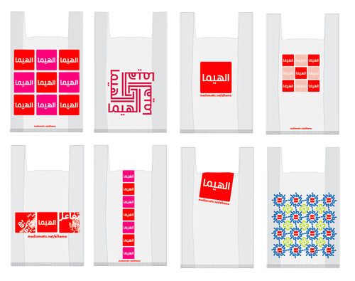

Je vous ai [déjà parlé des magasins HEMA](/le-design-c-est-hema). Pratique, design et bon marché, les magasins HEMA sont les fournisseurs officiels de mes lampes à vélo. Tous les ans HEMA regroupe des designers pour un concours mais cette année, la marque a été doublée par un autre concours de design.

<!--excerpt-->

### Mediamatic
[Mediamatic](http://www.mediamatic.net/) est un lieu de création très interessant situé au pied de l'emplacement provisoire du musée d'art moderne de la ville **[Stedelijk Museum Post CS](http://www.stedelijk.nl/)**. De nombreuses installations et conférences sur le design et les nouveaux médias y prennent place.

### Inspiré des magasins HEMA
En ce moment, Mediamatic présente [El Hema](http://www.mediamatic.net/elhema) (??????), un exercice de style sur ''l'ouverture d'un magasin HEMA en Afrique du Nord''. L'exposition ressemble donc à un magasin dont les affiches et présentoirs jouent sur la typographie arabe et une mise en scène capable de créer une identitée visuelle proche des célèblres magasins. Des animations sont organisées, ateliers de tatouages au henné, des danses et des présentations de travaux sur le design arabisant.

{.center}

### Le meilleur design
HEMA et le design sont très liés on le sait. Les designers de Mediamatic ont donc présenté leur projet **El Hema** (? ????) au [concours Néerlandais de Design 2007](http://www.nederlandsedesignprijzen.nl) dans la catégorie *identitée visuelle*. Apparemment ça a plut. [El Hema a gagné le concours](http://www.nederlandsedesignprijzen.nl/site/index.php?page=26&next=&a=25). Cette semaine, à l'occasion de la [museum nacht (n8)](http://www.n8.nl/), le magasin El Hema est [ouvert jusqu'à 22h le soir](http://www.mediamatic.net/set-20008-en.html) comme tous les soirs jusqu'au 6 janvier 2008.

{.center}

<!-- HTML -->

signé : 
<a href="http://xn--igb6a8bd4a.guillard.fr/">أليكس</a>

<!-- / HTML -->

<!-- post notes:
http://theplacedesign.wordpress.com/2007/08/19/el-hema/ 
http://www.ad.nl/cultuurenshow/article1606723.ece 
http://www.khtt.net/artefact-1726-en.html
--->
