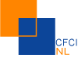

Je vous avais déjà parlé l'année dernière du salon «[I am not a tourist](/i-am-not-a-tourist)». Un salon entièrement anglophone qui attire les étrangers venus s'installer en Hollande et qui sont un peu perdus (mais pas comme des touristes). L'année dernière, je regrettais qu'il n'y ait pas de stand francophone alors qu'il y a tant d'associations prètes à accompagner les nouveaux expats dans les méandres de la vie outre Escaut.

Cette année toujours [pas d'association non anglophone](http://www.expatica.com/iamnotatourist/exhibitors_and_sponsors.html) présente sur le salon pour acceillir les latin, les slaves etc. Pourtant les français ne sont pas en reste. Cet automne les nouveaux expatriés français en Hollande ont eu droit à un accompagnement personnalisé.

### La chambre de commerce Française aux Pays-Bas
{.left}
Les chambres de commerce n'existent pas que sur le territoire national, elles sont aussi présentes à l'étranger[^1] elles peuvent apporter un soutien à toute entreprise désireuse de s'implanter ou d'exporter aux Pays-Bas. La CFCI des Pays-Bas existe depuis plus de 25 ans et offre aux entreprises les moyens de commencer une activité aux Pays-Bas. Elle propose de la documentation des conseils et même des services comme la domiciliation, la récupération de TVA et autres réjouissances. Elle est organise aussi des rencontres, des séminaires de réseautage très utiles pour les principaux partenaires de la chambre qui sont des entreprises bien installées, cherchant toujours à développer leurs activités.

### Le séminaire d'intégration

Puisqu'il semblerait que l'automne soit le meilleur moment pour choyer l'expatrié qui vient d'arriver, la CFCI des Pays-Bas organise à cette période un séminaire d'intégration. La cible de ce séminaire sont les professionnels français et francophones fraichement débarqués qui veulent rapidement savoir tout sur ce qui va leur tomber dessus aux Pays-Bas. Sont abordé les condition de travail et la fiscalité. [Ce séminaire](http://www.cfci.nl/Page%20d'accueil/index.htm) annuel a eu lieu hier. Comme je n'y ai pas participé, je ne peux vous parler que du programme que voici:
<!-- HTML -->

<!-- / HTML -->
Les **aspects culturels** de la vie aux Pays?Bas: présentation de modèles   
qui permettent d?expliquer les différences culturelles.    
Les aspects liés au **droit du travail** et les différences avec la France:    
le contrat de travail, la couverture sociale.   
La **fiscalité** des sociétés et des personnes, le 30% regeling.   
Le séminaire se termine par un **témoignage** d?un chef d?entreprise français    
travaillant aux Pays?Bas.   
<!-- HTML -->

<!-- / HTML -->

Le séminaire s'est déroulé chez **Loyens & Loeff N.V.** société locale de conseils juridiques et fiscaux. Loyens & Loeff N.V. est évidement membre de la CFCI mais si un jour je reparle de cette société ce sera surtout pour son siège social, un bâtiment qui vaut vraiment le détour. Les inscrits à ce séminaire on eu bien de la chance d'évoluer dans ces bureaux. 

La journée s'est terminée par un pot offert par l'un des partenaires de la CFCI. Ces pots réguliers sont un bon moyen de rencontrer de nouvelles personnes ayant le français en partage et le business en tête. La CFCI organise plusieurs pots du même genre au cours de l'année où l'on boit des coups et l'on échange des cartes de visites. Hier, le pot était proposé par **la ville de Tilburg** mais avait lieu à Amsterdam dans la Grand Ball Room de l'hotel Krasnapolsky. Je crois que j'ai parlé de cet hotel [il y a peu](/c-etait-ripe-55-meeting).
---
[^1]: À ce jour, il y a 112 chambres françaises de commerce et d'industrie présentes dans 78 pays