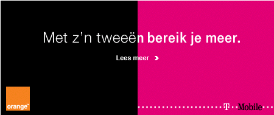
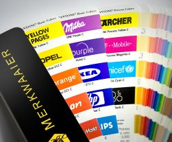

Parmi [les petites courses de l'été](/les-petites-courses-de-l-ete), T-Mobile a racheté Orange Nederland. Le groupe allemand doit maintenant rassurer très vite ses actionnaires en montrant qu'il n'y aura pas d'argent gaché à assurer un double service commercial. La marque Orange est donc appelée à disparaitre de Hollande et certaines boutiques devraient fermer. Pour l'instant on rassure la clientèle en leur racontant que deux réseaux, c'est deux fois mieux ah ah ah...

{.center}

Mais il y a plus drole, cette histoire de couleurs ne s'arrête pas là.

## Une histoire de couleurs

{.right}
Il y a deux ans, quand Monsieur Stelios a lancé [Easymobile](http://www.easymobile.com/) au Royaume-Uni, il a été [ataqué par Orange](http://www.coolsmartphone.com/news1301.html), ce dernier l'accusant d'utiliser **sa** couleur pour semer le trouble dans le marché. T-Mobile ayant racheté Orange, les méthodes d'une entreprise peuvent être aussi employées dans l'autre quite à répéter les conneries. T-Mobile a récement attaqué quelques marques néerlandaises[^1] utiliseant **son** Magenta dans leur logo. Selon [le blog qui m'a filé l'info](http://www.adverblog.com/archives/003298.htm), T-Mobile argue qu'elle a déposé cette couleur comme marque commerciale aurpès de l'[oami](http://oami.europa.eu/en/default.htm). Je ne vais pas commencer un débat ici sur le droit des marques[^2] on voit bien que ce dépot de marque est nul et que ces poursuites sont idiotes. De nombreux activistes s'en offusquent à commencer par les premier à utiliser le magenta: les designers. Ainsi, le site [freemagenta.nl](http://www.freemagenta.nl/) est un brillant homage coloré à la couleur source du litige, tandis que d'autres signent une pétition pour [qu'on leur rende le magenta](http://www.adverblog.com/archives/003298.htm).

<!-- HTML -->

<a href="/Katja-Shuurmann-cover-girl-pages-jaunes" title="Katja Shuurmann, la cover girl de Gouden Gids">
<!-- / HTML -->
{.left}
**Katja Shuurmann**  
  
Découvrez la cover-girl des pages jaunes néerlandaises.
<!-- HTML -->
</a>

<!-- / HTML -->

<!-- HTML -->

<a href="/les-numeros-utiles" title="Les numéros de services au tarif normal">
<!-- / HTML -->
{.left}
**Les numéros de service NL**  
  
La liste des numéros directs vers les services téléphoniques les plus courants aux Pays-Bas.
<!-- HTML -->
</a>

<!-- / HTML -->
---
[^1]: parmi elles, [Slam FM](http://www.slamfm.nl/) avec qui j'ai fait [des pages web](/de-mon-boulot) magenta pour vendre ... des sonnerie de téléphone
[^2]: On sait tous que le droit des marques est parfois très bizarre et mériterait d'être toiletté un peu.
<!-- post notes:
http://www.24oranges.nl/2007/11/14/copyright-trolls-cozzmoss-catch-two-infringers/
--->
