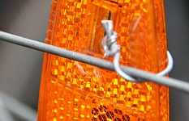
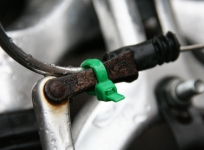
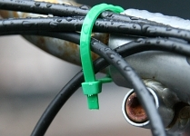
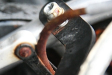

Dimanche, [en rentrant du défilé](/saint-nicolas-est-revenu-sinterklaas-is-terug) des [Zwarte Piet](/qui-est-tu-zwarte-piet), je suis rentré dans une voiture avec mon vélo. Rien de violent [cette fois, aucune chute](/premier-gadin); mais mon frein avant était défait et ma distance de freinage était vraiment trop grande. J'ai donc profité du beau temps pour réviser [ma bicyclette](/un-b-twin-a-amsterdam) qui a beaucoup vieilli dans la rudesse de sa vie Amstelodamoise (un an et demi déjà). Voici quelques photos pour vous raconter la révision. Attention, ce sont des close-up et cela pourrait choquer les personnes sensibles.

{.left}
**Les réflecteurs latéraux sont obligatoires** aux Pays-Bas, tout comme [les lumières la nuit](/lumieres-hiver). Mon vélo n'a pas de jante réfléchissante comme beaucoup de vélos hollandais mais des bidules en plastique bon marché. Ils ont rapidement été cassés alors que la route secouait le vélo. J'ai donc tenté de les refixer pour être en rêgle.
<!-- HTML -->

<!-- / HTML -->
{.left}
**Le frein avant se barrait tout le temps**, arraché par des voisins de parking ou juste par la tention du cable. avec ce cerclage en plastique, j'espère que cela ne se reproduira plus. J'en ai profité pour ressérer les freins, c'était pas du luxe.
<!-- HTML -->

<!-- / HTML -->
{.left}
Pour éviter l'arrachement des cables de frein et de vitesses dans les garages à vélos, j'ai essayé de domestiquer un peu tous ces cables fous avec un autres cerclage en plastique. On dirait pas comme ça mais **les vélos hollandais sans vitesse et avec rétropédalage**, ils n'ont pas ces problèmes d'arachement de câble.

<!-- HTML -->

<!-- / HTML -->
{.left}
Les gaines de câbles, les écrous, le guidon sont tous bien rouillés maintenant, **j'ai un vrai vélo qui dort dehors** et sert tous les jours. Je ne sais pas combien de temps il va tenir à ce rhytme là. Un vrai vélo hollandais, c'est vraiment de meilleur qualité qu'un [B-twin](/un-b-twin-a-amsterdam) bon marché. Enfin, quand je regarde ses voisins, ils ont beau être hollandais, ils sont bien rouillés aussi. J'ai quand même regonflé les pneus, et resserré le frein arrière, c'était pas du luxe.

<!-- HTML -->

<!-- / HTML -->
{.left}
Le grand plateau était protégé par une plaque de plastique translucide et supercool. Elle n'a pas fait long feu, partant en petits bouts à chaque choc. Un dernier vestige tient à cette vis ci-contre. De toute façon, elle ne serait pas à grand chose, mon pantalon se prenait quand même dans la chaine, je dois être le seul en ville à attacher mon pantalon pour faire du vélo. Allez, pour finir, **j'ai graissé la chaine**, là aussi, c'était pas du luxe.

<!-- HTML -->

<!-- / HTML -->

--- 
