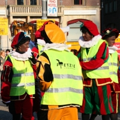
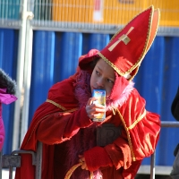
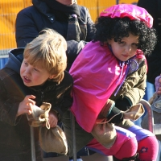
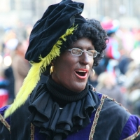

Comme tous les ans, [Saint-Nicolas revient](/sinterklaas-est-arrive/) sur son bateau, le pakjeboot 12. Comme tous les ans, il est accompagné de ses compagnons, [les Zwarte Piet](/qui-est-tu-zwarte-piet/). Cette année il a débarqué samedi 17 novembre à Kampen, petite cité d'Overijssel. Le lendemain, il paradait à Amsterdam. J'y étais.

Le site Sinterklaas à Kampen indiquait bien sa venue en bateau pour le samedi mais je ne suis pas allé là bas. Des affiches à Amsterdam indiquaient la venue du Saint le lendemain, ce qui est bien plus pratique pour moi. Il ne me restait plus qu'à me mettre sur son passage et attendre. Il y avait là beaucoup d'enfants qui voulaient le voir comme moi et déjà les Zwarte Piet défilaient et donnaieent des pepernotten. Les Zwarte Piet étaient déguisés en policiers pour pouvoir faire partie du défilé et les enfants étaient déguisés en Zwarte Piet pour attirer Saint Nicolas. J'ai aussi vu passer des fanfares et une ambulance mais je n'ai pas vu le grand barbu avec son costume rouge. Je suis parti trop tôt je pense. De toutes façons, les gens préfèrent les Zwarte Piet, ils sont plus rigolos.

  

 

  

  

 

  

  

 

  

  

  

