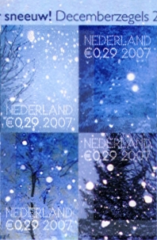

[{.right}](/timbres-en-promo) J'ammène encore une fois le prix du timbre sur le tapis. Il y a ce mois ci une **diminution du prix du timbre aux Pays-Bas**. Chouette# Cette offre est limitée et ça c'est moins chouette...

[{.left}](/public/images/scans/sneeuw-decemberzegels-2007.jpg) Pour les fêtes, la poste a émis quelques planches de timbres de saison avec de la neige (*sneeuw*) partout dessus. Le plus interessant avec ces timbres et leur prix : 0,29€ permettant d'envoyer une carte aux Pays-Bas ce qui fait quand même **plus de 34% d'économie** par envoi. Hélas, on ne peut utiliser ces timbres que pour l'envoi de courrier aux Pays-Bas jusqu'au 4 janvier 2008. 

<!--excerpt-->

On ne peut donc pas envoyer de v?ux en promo ailleurs dans le monde ? En fait si# Une petite note au dos de ces planche indique que l'on peut affranchir son courrier à destination de l'Europe au tarif normal et que ce dernier sera acheminé en prioritaire. [0,67€ au lieu de 0,72€](http://www.tntpost.nl/voorthuis/brieven-en-kaarten/naar-het-buitenland/wat-kost-het.aspx) soit presque 7% d'économie. Avec son tarif permanant de 0,60€ pour tout envoi (de moins de 20g) dans l'Union Européenne[^1], **la poste française est plus compétitive que son homologue néerlandaise**. Mais il ne faut pas en vouloir à [TNT Post](/la-poste-prends-les-couleurs-d-halloween), cette entreprise est privatisée depuis plus de vingt ans, il est donc normal que le service soit plus cher et de moins bonne qualité.

Alors pour se rattraper, la poste française propose des timbres plus chers à l'occasion des fêtes. des [timbres «Croix-Rouge»](http://timbres.laposte.fr/detailarticle.jgi?index=6&idArticle=1106470). Chaque timbre d'un carnet *Croix Rouge* coûte 1,70? de plus qu'un timbre normal soit une augmentation de +86%, mais au profit d'une ?uvre de bienfaisance. Rien d'obligatoire à cet extra, la poste commercialise aussi des [timbres de fête](http://timbres.laposte.fr/detailarticle.jgi?index=8&idArticle=1106481) au tarif habituel. En fait, en France comme aux Pays-Bas, on a le choix…

---
[^1]: voir [tarifs postaux de la poste au départ de la France Métropolitaine](http://laposte.fr/IMG/pdf/Tarifs_au_depart_de_France_Metropolitaine_a_compter_du_15_janvier_2007.pdf) (PDF)