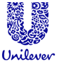
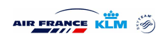

Vendredi 7 décembre 2007, la [Revue de presse néerlandaise de l'ambassade](http://www.ambafrance.nl/article.php?id_article=9127) citait [Elsevier](http://www.elsevier.nl/) pour parler du succès des fusions d'entreprises franco-néerlandaises.

> "Les fusions britannico-néerlandaises n’ont pas toutes été un succès", remarque Olivier van Beemen depuis Paris. "Alors que les Français et les Néerlandais s’avèrent pouvoir coopérer étonnamment bien. Les fusions franco-néerlandaises sont en forte croissance ces dernières années." "’Les entreprises néerlandaises avaient une tache aveugle. Elles ne regardaient que le monde anglo-saxon’, explique Niels Noorderhaven, professeur de management international de l’Université de Tilburg. ’La France ne manifestait pas trop d’intérêt non plus. Mais lorsque les premières fusions franco-néerlandaises se sont faites, d’autres entreprises ont pensé : ces entreprises néerlandaises sont peut-être intéressantes après tout.’ Noorderhaven étudie la fusion entre Air France et KLM. Il pense qu’on surestime les différences culturelles et les problèmes linguistiques entre partenaires néerlandais et français, alors qu’on sous-estime au contraire ceux qui existent entre Néerlandais et Britanniques."

{.left}
Parmi les deux plus grandes entreprises Néerlandaises, deux sont issues de la fusion d'entreprises britaniques et néerlandaise. Il s'agit de **Shell** et d'**Unilever**. Pour Shell, je ne sais pas trop mais pour la deuxième, je peux affirmer que l'entreprise est connue pour ses licenciements à répétition apparemment dus à un manque de vision à long terme[^1]. Je parlais il y a peu de la [sission de Boursin](/les-petites-courses-de-l-ete)[^2] mais la situation des gens de Miko en France ou de Unox aux Pays-Bas est toujours incertaine.

{.right}
D'un autre coté, on a un cas d'école nommé **Air-France-KLM**, entreprise née de la fusion entre les deux leaders français et néerlandais du transport aérien et devenant ainsi le [premier transporteur aérien du monde](/benefices-franco-neerlandais). Dans les faits, c'est Air France qui rachète KLM mais cette réalisation a toujours été présenté comme une fusion. Mieux, KLM conserve son indépendance commerciale, son hub d'Amsterdam Schiphol et son marché propre. Les synergies sont recherchées partout ou elle peuvent avoir lieu (fret, maintenance, logistique, informatique...) dandis que chaque compagnie tente de développer son marché en entretenant un dialogue permanant. Une réalisation de ce dialogue est le lancement de la compagnie **Transavia France** sur le modèle de [Transavia](/un-voyage-avec-transavia), filiale de KLM aux Pays-Bas. Olivier van Beemen a du penser à cette entreprise en parlant des alliances franco-néerlandaises qui marchent mais il y a d'autres exemples. **Atos-Origin** en son temps aurait peut-être pu servir aussi de cas d'école pour aider les anglo-saxons...
---
[^1]: voir [Unilever désespère ses salariés européens](http://www.lemonde.fr/web/article/0,1-0@2-3234,36-985236@51-982220,0.html).
[^2]: On sait aujourd'hui que Boursin va faire partie des **fromageries Bel**.