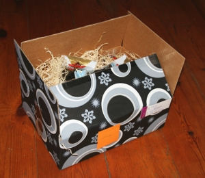

Une fois n'est pas coutume, je vais comparer les traditions hollandaises aux traditions anglaises. Je vous ai parlé l'année dernière des [trois jours de Noël](/noel-des-pays-bas). Contrairement à ce qu'il se passe en France, Le lendemain de Noël est ferié dans ces deux pays. Je me suis dit qu'il avait peut-être un rapport entre le *dweede kerstmis* hollandais et le *boxing day*, ferié au Royaume-Uni et dans d'autres pays anglo-saxons. Il faut d'abbord savoir ce que signifie ce boxing day que l'on célèbre outre-Manche.

<!--excerpt-->

## Boxing day in the UK

Lors de mon seul Noël en Angleterre, il y a bien longtemps, on m'a raconté que dans l'ancien temps, c'était le jour où l'on ouvrait les cadeaux. J'étais jeune et pressé, heureusement que nous n'avons pas respecté cette tradition. D'autres racontaient que boxig day était le jour ou l'on sortait les cartons vide de la maison après avoir ouvert les cadeaux. Rien de tout cela n'est vrai.

Selon un site de légendes urbaines, 
Ce jour du 26 décembre est le [jour de la Saint-Etienne](http://nominis.cef.fr/contenus/fetes/26/12/2007/26-decembre-2007.html), *St Stephen* en anglais, premier marthyr chrétien. De son vivant, Etienne etait un des premiers chrétiens de Jerusalem. Dans cette première communauté, il a reçu la responsabilité d'acceuillir les pauvres veuves, le service de la charité qui a du l'ammener à faire des petits paquets pour les pauvres. C'est peut-être en souvenir de ce saint que ce jour était autrefois consacré à faire des cadeaux aux gens moins nantis. C'est surtout aussi, une occasion de soulager sa concience après la débauche de cadeau faite à ses proches et ses pairs. 

Le 26 décembre était consacré à la remise de cadeaux aux plus pauvres cotoyés pendant l'année. Il y a bien longtemps les riches marchands faisait des petits paquets pour les gens du peuple qui parfois travaillait dans les entrepôts. C'est aussi le 26 décembre que dans la tradition britanique, les serviteurs allaient voir leur maîtres avec de petites boites pour que ces derniers y mettent de l'argent, les étrennes quoi... De même, les employeurs pouvaient profiter de cette date pour offrir un cadeau à leurs employés. 

Maintenant que ce jour est légalement férié, l'usage du cadeau aux employés est resté mais il se fait un autre jour; un jour non chômé ou le salarié est disponible. C'est là que la tradition anglaise rejoint celle des Pays-Bas. Le cadeau de Noël aux employés est ici une pratique courante.

### Nouveau mot : Kerstpakket

{.center}

Chaque année à Noël il y a des échanges de cadeaux. J'ai déjà parlé des [cadeaux d'entreprise](/les-cadeaux-d-entreprise) dont la distribution est généreusement faite à la mode néerlandaise mais il y a aussi des cadeaux que les patrons offrent à leurs salariés. Je ne vous en ai pas parlé l'année dernière parce que [mon employeur d'alors](/de-mon-boulot) ne pratiquait pas ce genre de tradition. [Mon nouveau patron](/mon-nouveau-boulot-3) est plus généreux et nous a proposé de choisir notre cadeau dans un catalogue avec un budget-points donné. Comme quand j'étais enfant, je n'ai pas eu trop d'idée alors j'ai un peu pris n'importe quoi pour éviter d'avoir le colis surprise... Quelques jours avant Noël, J'étais très content de recevoir mon petit paquet à l'occasion d'un pot organisé dans l'entreprise. Apparement cette tradition plait beaucoup puisque sur [le forum des hollandais](/le-forum-des-hollandais), les gens racontent [ce qu'ils y avait dans leur kerstpakket](http://www.leforum.nl/phpBB/viewtopic.php?t=13115), quand il y en avait un...

<!-- post notes:
[Boxing Day in the UK|http://www.dti.gov.uk/employment/bank-public-holidays/index.html]
--->
