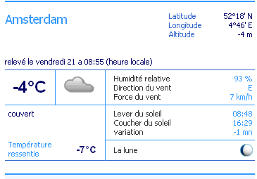
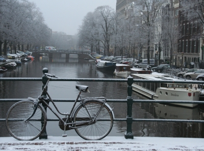

Il fait froid. mais encore plus ici. Avant je ne comprennais pas pourquoi j'avais si froid alors que la météo indiquait des températures assez ordinaires. Maintenant je sais pourquoi. Explications.

Quand on regarde la météo internationnale sur le site web de TV5, l'explication est là: température **-1°c**, température ressentie **-7°c**. Ces chiffres dates d'hier, aujourd'hui on a plutôt ceci :

[{.center}](http://tv5.org/TV5Site/meteo/detail_ville.php?&id_ville=297&langue=fr)

<!--excerpt-->

TV5 explique ensuite ce qu'est la température ressentie. Les températures annoncées étant toujours prises sous abri, il y a parfois une grande différence entre la température relevé et celle que l'on subit réèlement.

> La température ressentie, ou facteur de refroidissement éolien, est
> calculée en combinant la température de l'air et la vitesse du vent. Ce
> calcul exprime la température ressentie par le corps humain en présence de
> temps froid et venteux.

## Amsterdam sous la neige

A Amsterdam, ville plate, humide et éloignée de toute montagne, inutile de vous dire que la température ressentie est toujours inférieure à la température relevée... Heureusement, aujourd'hui il a neigé, le vent est tombé et même si la température est plus basse qu'hier, la température ressentie n'est pas plus rude. C'est déjà assez froid comme ça.

{.center}
<!-- HTML -->

moi aussi je peux prendre des photos de touriste...

<!-- / HTML -->

* voir aussi [La météo européenne](/meteo-europeenne).
