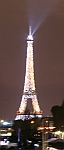
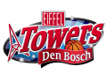

{.left}
Un des 24 morceaux de l'escalier de **la tour Eiffel** a été mis en vente le 17 Novembre chez Drouot. L'heureux aquéreur a mis le paquet pour décrocher le morceau d'escalier: 180.000 euros ...  Il s'aggit d'un néerlandais, Erik Kurvers, dirigeant d'une société qui porte le nom de l'ingénieur français.

C'est l'Algemene Dagblad qui a annoncé la nouvelle : [Voorzitter koopt trap Eiffeltoren](http://www.ad.nl/sport/article1835557.ece), Le Président achête l'escalier de la tour Eiffel. Erik Kurvers est en effet président de **la société Eiffel**, un cabinet de conseil juridique et fiscal installé à Arnhem. Il a appellé sa société en hommage à l'ingénieur français et vu tout l'argent qu'il a sorti pour s'offrir le bout de ferraille, on peut dire que c'est un fan. 

{.right}
Sur [le site de la société](http://www.eiffel.nl/) on apprend que le siège de la société en question est à Bois-le-Duc (*Den-Bosch*). Cette ville du Brabant Septentrional est connu pour son équipe de basketball évoluant en première division des Pays-Bas (*FEB Eredivisie*). L'équipe porte de nom de **[EiffelTowers](http://www.eiffeltowers.nl/home.html)**. Le sponsor de l'équipe n'est autre que le même Erik Kurvers. Ce dernier espère peut être faire monter l'équipe au plus haut dans les classements. Hélas, hier, presque un mois jour pour jour après l'achat de cet escalier, l'équipe de Den-Bosch s'incline devant Hapoel Jeruzalem 112 à 97 au cours d'un match de la coupe de l'ULEB. C'est dramatique comme le dit le Brabant Dagblad : *[Dramatisch kwart nekt EiffelTowers](http://www.brabantsdagblad.nl/eiffeltowers/2342225/Dramatisch-kwart-nekt-EiffelTowers.ece)*, les [EiffelTowers sont maintenant 10e](http://www.euroleague.net/ulebcup/competition/statistics/teams/accumulated) et ils ont intéret à se ressaisir s'ils veullent monter sur les marches du podium. Au pire, il leur restera celles de l'escalier.
---
<!-- post notes:
http://afp.google.com/article/ALeqM5iNfODZjxKF3_Ma-upY2knxwBc57Q
--->
