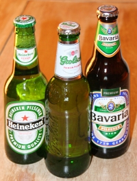

Voilà un moment que je voulais vous parler d'une des succès agroalimentaire de la hollande: **la bière**. L'une des plus grande entreprise mondiale du secteur (Heineken) est originaire d'Amsterdam. [En France](http://www.journaldunet.com/management/0602/0602120biere.shtml), **Heineken** est la deuxième entreprise brassicole avec les marques **Pelfort** les **brasseries Fisher**. La production du groupe y talone celle des **brasseries Kronembourg**.

[{.right}](http://commons.wikimedia.org/wiki/Image:Heineken-Grolsch-Bavaria.jpg)
Au Pays-Bas, le groupe Heineken possède plusieurs marques aussi et partage son marché avec deux autres entreprises brassicoles nationales : **Grosch** et **Bavaria** auquel il faut ajouter le groupe belge **INBev** qui vend la **Domesch** batave. La bière est un produit important dans la culture néerlandaise, c'est un produit de convivialité comme en témoigne les nombreux *borell* le vendredi soir dans les entreprises et sur les terasses. En 2006 il s'est bu [1,8 millions de litres de bière aux Pays-Bas](http://www.zqcentral.com/index/news/show/6262). Un énorme marché que ces quatre grands brasseurs se partagent paisiblement, très paisiblement, trop paisiblement...

## La bière est trop chère
Trop paisiblement même, depuis 1996 le prix de vente de la bière aux Pays-Bas. Les grands du secteur se mettaient d'accord pour augmenter ensemble les prix formant ainsi un cartel de la bière au détriment des consommateurs. La commission Européenne a infligé des amendes à la bande des quatres pour non respect des rêgles de concurences[^1]. Il y en a pour cher et les consommateurs de bière ne verront pas baisser les prix pour autant. Le site [bierverliesmeter](http://www.bierverliesmeter.com/) propose aux internautes de calculer l'agent qu'ils ont perdu à cause de cette entente et lance un concours pour trouver la meilleure idée de demande de compensation (en mousse ou en nature).

## Malt, houblon et concentration
En 2005 **SABMiller** a racheté un groupe brassicole colombien (numero un dans son pays) homonyme de la brasserie Néerlandaise **Bavaria**. SABMiller, un groupe sudafricain, est devenu ainsi deuxième mondial du secteur. Ce dernier a annoncé la création d'un *joint-venture* avec **Molson Coors** , numéro cinq mondial, pour commercialiser leurs produits aux États-Unis, sur le plus grand marché de **Anheuser-Busch** (**Budweiser**), numéro trois mondial. SABMiller est aussi en train de [racheter](http://www.blogagroalimentaire.com/?2007/12/03/915-sabmiller-rachete-grolsch-au-prix-fort) **Grolsch**, deuxième brasseur Néerlandais. Pendant ce temps, **Scottish & Newcastle**, numéro sept du secteur qui détient les **brasseries Kronembourg**, numéro un du secteur en France, [vient de refuser une offre](http://www.drinks-business-review.com/article_news.asp?guid=6253E841-AF37-450E-8E6E-99952A17F9FD) de rachat (avant dépeçage) de **Heineken**, numéro quatre mondial et numéro un à Amsterdam, associé à **Carlsberg**, le Danois numéro six mondial et numéro un sur les maillots de l'équipe de foot de Liverpool, qui eux ont plusieurs numéro.

Vous pouvez aussi lire: [Les petites courses de l'été](/les-petites-courses-de-l-ete)
---
[^1]: [273 ME d'amende pour Heineken, Grolsch et Bavaria pour un cartel aux Pays-Bas](http://www.boursier.com/vals/EUROPE/biere-273-me-d-amende-pour-heineken-grolsch-et-bavaria-pour-un-cartel-aux-pays-bas-news-230424.htm)