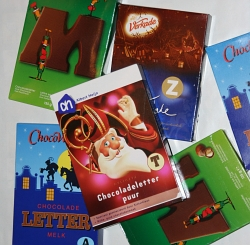

Aujourd'hui c'est *pakjesavond* (le soir des paquets). Les gamins vont s'en mettre plein la panse parce que [Saint-Nicolas](/sinterklaas-op-de-dam-il-est-toujours-la) arrive pour leur donner des cadeaux et des friandises. Parmi les friandises les plus appréciées à cette occasion, il y a **les lettres en chocolat** qu'on appelle ici *chocoladeletters*, pour une fois c'est pas trop compliqué. L'histoire de ces lettres en chocolat est très ancienne.

<!--excerpt-->

Cette tradition n'est peut être pas aussi vieille que celle de Sinterklaas mais elle a bien une centaine d'années. Avant cela, la nouriture prenait déjà la forme de lettres. Au Moyen-Age, on confectionnait des petits pains en forme de lettre pour apprendre l'alphabet aux enfants. Une fois la leçon terminée, ils pouvaient manger le petit pain en guide de récompense.

Au 19e siècle, les cadeaux livrés par Sinterklaas étaient recouverts d'un drap et un pain en forme de lettre indiquait son destinataire. Ces lettres sont vites devenues des friandises que les enfants attendent autant que les cadeaux de la Saint-Nicolas. Il est possible de trouver, encore aujourd'hui, des lettres patés en croûte chez les bouchers et d'autres patisseries alphabétiques chez certains boulangers. Quand le chocolat a commencé à se popularisé, les lettres en chocolat sont devenues un gourmande alternative. On date les premières lettres en chocolat aux alentours de 1900.

{.right} De nous jours, ces lettres en chocolat sont vendues du **1er octobre au 5 décembre** un peu partout sous des marques de chocolatiers comme ***Verkade*** ou des marques de distributeurs. La lettre la plus vendue est le **M**. C'est vraisemblablement parce que c'est la première lettre de maman (*moeder* ou *mama*); c'est peut-être aussi que les gens pensent qu'il y a plus de chocolat dans cette grosse lettre. En fait il y a le même poids de chocolat dans tous tes les lettres (sauf le **I** parfois vendu par paire). On raconte que la police de caractères la plus utilisée pour fabriquer ces lettres est la [police Egyptienne](http://en.wikipedia.org/wiki/Egyptienne) qui a de grosses sérifications et pas de zone fine qui serait trop cassantes. En fait, les fabriquants prennent quelques libertés avec les dessins de cette police parce qu'ils arrivent à faire tenir le même poid de chocolat dans chaque lettre.

Début décembre, il devient parfois difficile de trouver la lettre que l'on veut. Les magasin ne réaproisionnent plus leurs rayons sachant que la vente se termine le 5 décembre. Passé cette date, il n'est plus possible d'en trouver, pas même en promotion. Le chocolat est renvoyé en usine ou il est fondu dans un autre moule. Hier, les dernières lettres qui restaient pour S. étaient le **T** et le **D**.

Vous pourrez en savoir plus sur les lettres en chocolat sur le site qui en porte le nom : [chocoladeletter.net](http://www.chocoladeletter.net/) tout en néerlandais. 

<!-- HTML -->
<!--
La pub qui suit est en hollandais aussi et vous propose d'acheter des lettres au Saint Nicolas vert, au profis d'une ?uvre de charité.
<object width="425" height="355"><param name="movie" value="http://www.youtube.com/v/R2XDX9p3n2g&rel=1"></param><param name="wmode" value="transparent"></param><embed src="http://www.youtube.com/v/R2XDX9p3n2g&rel=1" type="application/x-shockwave-flash" wmode="transparent" width="425" height="355"></embed></object>
-->
<!-- / HTML -->

<!-- post notes:
http://www.stnicholascenter.org/Brix?pageID=521
--->
