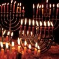

[{.left}](http://commons.wikimedia.org/wiki/Image:Hanukiyot.jpg) C'est aujourd'hui que commence la fête juive d'**Hanouka**, **Hannukkah**, **fête de la dédicace** ou **fête de la lumière** qui dure 8 jours. Les français (qui ne savent pas prononcer les *khreu*) ont transcrit ????? par **Hanouka**; ils n'aspirent même pas le *H* alors que les Néerlandais qui se gratent la gorge avec leur *ch*, sont proches de la prononciation hébrahique du *Het* (?), ils écrivent *Chanoeka*.

Hanouka est une fête de décembre comme bien d'autres qui vont suivre elle une connotation spéciale à Amsterdam voici pourquoi.

## L'avent, l'hiver
Dimanche dernier, c'était le premier dimanche de l'avent, période d'un mois précédant Noël, pendant laquelle les chrétiens attendant la naissance du Christ. À [la paroisse francophone](/bonne-fete-pascales), le prètre nous a proposé de nous préparer à cette venue en regardant d'où venait le Christ, ses ancêtres son éducation, sa mère... Il était juif. Ainsi nous a-t-il rappelé que l'ancien testament est un livre juif et que nombre de citations de Jésus sont des citations de cet ancien testament, un héritage qu'on oublie parfois.

Cet héritage est pourtant très présent à Amsterdam, ville ouverte qui a souvent acceuilli les peuples persécutés ailleurs. Les juifs y on trouvé un havre et y ont prospéré dans la taille des diamands ou le négoce, participant de la richesse de la ville. Depuis la seconde guerre mondiale, les juifs ne sont plus aussi nombreux à Amsterdam mais la ville a gardé cette influence passée...

## Nouveau mot : Mokum (Amsterdam)
Mokum est un nom hébreu et Yidish (*מקום*) qui signifie lieu, endroit. Certaines villes d'Allemagne ou des Pays-Bas étaient appelée *mokum* suivit de la première lettre de la ville dans l'alphabet hébreux (le même que le Yidish). Amsterdam était ainsi appellée **מקום א** mais elle est devenue très vite *Mokum* sans le א parce que pour nombre de juifs, Amsterdam etait **la** ville. Ce nom autrefois connoté a aujourd'hui une portée plus sentimentale à l'égard de la ville. *[Pride of Mokum](http://www.ajaxpride.nl/)* est même le nom des supporters terribles de l'AJAX. Je peux aussi vous conseiller le [groupe Mokum](http://www.flickr.com/groups/mokum/pool/), le groupe de photos d'Amsterdam sur flickr.

À Mokum comme ailleurs bonne fête d'Hanouka.

<!-- post notes:
Il nous a aussi rappellé que nous étions de la deuxième alliance (au temps de Jesus) la première alliance de Dieu avec son peuple (au temps de Moïse) n'a jamais été reniée par la deuxième alliance. Mais j'arrête là mon cathéchisme.
--->
