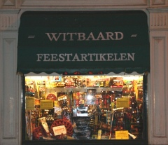

[{.left}](/public/images/photos/2007-11/petards-in-witbaard-feestartikelen500.jpg) Cette année, **le jour de l'an** tombe un premier janvier comme tous les ans.

Le nouvel an hollandais ressemble beaucoup au nouvel an chinois niveau bruit, Je vous en ai [déjà parlé](/les-bruits-du-nouvel-an). La principale préparation de ce qu'ils appellent **Ancien et Nouveau (*Oud & Nieuw*)**[^1] semble être l'achat de pétards, de bombes et de fusées pour en mettre plein la vue et les oreilles à l'instant même ou l'ancien laisse place au nouveau. La boutique qui vend parfois [des trucs oranges](/preparatifs-oranges) a donc transformé sa deventure pour cet évènement qui n'arrive qu'une fois l'an.

<!--excerpt-->

Mais attention, les feux d'artifices sont dangereux; il faut le rappeller.

Je vous ai exposé l'année dernière les préparatifs à base de [bouchage de boîte-aux-lettres publiques](/nouveau-mot-vuurwerk) mais il y a parfois d'autres dégats caussés par cette folie de chaleur et lumière. Les accidents arrivent chaque année et pour en éviter le maximum, la loi limite la vente de ces feux d'artifices aux 28, 29 et 30 décembre dans des magasins agréés. Le tirage des feux d'artifice n'est autorisé que du 31/12 à 10h00 jusqu'au 1er janvier à 2 heures. Il semble que les Amstelodamois tiennent à leur liberté et ne respectent pas scrupuleusement la loi comme en témoigne les éxplosions qu'on entend ça et là depuis quelques jours.

Pour rappeller les dangers de des pétards, une campagne virale a été lancée sur Youtube, là même ou les ados postent des [explosions de poubelles](http://www.youtube.com/watch?v=BUTCsXt8YrM) filmées avec leur mobiles.

<!-- HTML -->

<object width="425" height="355"><param name="movie" value="http://www.youtube.com/v/UeOlJv6wYkw&rel=1"></param><param name="wmode" value="transparent"></param><embed src="http://www.youtube.com/v/UeOlJv6wYkw&rel=1" type="application/x-shockwave-flash" wmode="transparent" width="425" height="355"></embed></object> 
<b>Les feux d'artifices aussi sont dangereux</b>

<!-- / HTML -->

---
[^1]: L'année dernière j'ai expliqué que l'on disait *Oudejaarsavond* mais j'ai découvert récemment cette nouvelle appellation qui n'a peut-êre de nouveau que le nom