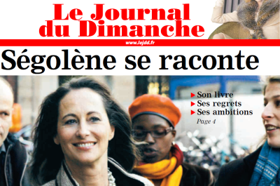
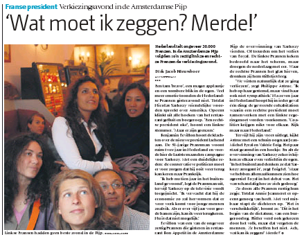

Bon, ce n'est parce que je ne suis pas en France que je ne me renseigne pas sur les potins et les derniers gossips. J'ai bien eu vent de l'histoire de Ségolène Royal qui ne veut plus entendre parler de Hollande. Ce n'est apparement qu'un bruit qui court parce qu'en voyant le Journal du Dimanche, j'ai bien remarqué que l'ancienne candidate à la Présidence de la République était en Hollande il y a peu.

{.center}

D'accord, le jeux de mot était facile. Je ne savais pas comment introduire cette histoire. Il me faut maintenant vous expliquer pourquoi une pareille affirmation à la vue de cette photo du [JDD](http://www.lejdd.fr). **Ségolène Royal était bien à Amsterdam** sur cette photo. On y voit clairement, à l'arrière plan, un parking à vélo hollandais ([voir une photo de vélos](/le-temps-de-gate)) et les couleurs bleues et blanches d'un tram de la ville ([voir une photo de tram](/encore-des-travaux-sur-ferdinand-bolstraat)).

Autre indice que je peux partager avec vous est la présence de cette blonde à gauche de la femme politique. Cette blonde est **une hollandaise** et elle est  apparement dans tous les plans ou les français parlent politique. On la retrouve en photo dans un autre journal (le gratuit *[De Pers](http://depers.nl/)*) au lendemain des élections présidentielles  françaises[^1].

{.center}

Le dernier indice vient d'un autre article de journal, [le Volkskrant, parlant de Women inc.](http://www.volkskrant.nl/binnenland/article483361.ece/Zusters,_ga_in_de_tegenaanval), une conférence sur le féminisme qui a eu lieu ce week-end à *Beurs van Berlage* [^2]. La princesse Máxima et Ségolène Royal étaient les invitées les plus attendues, le seconde devant intervenir le samedi. Mirjam, la hollandaise blonde des photos, a servit d'interprète. Apparement sa prestation de traduction a été très bonne parce que, d'après ce qu'on m'a dit, Ségolène Royale a été très applaudie.
---
[^1]: voir article sur le sujet: [Encore un dimanche d'élection](/encore-un-dimanche-d-elections)
[^2]: voir [photo de Beurs van Berlage](/i-am-not-a-tourist)