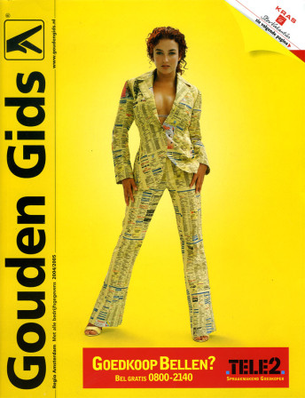
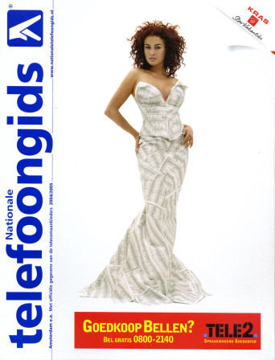
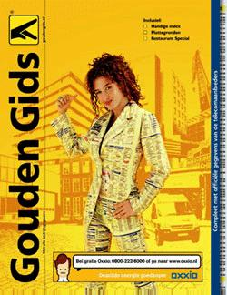
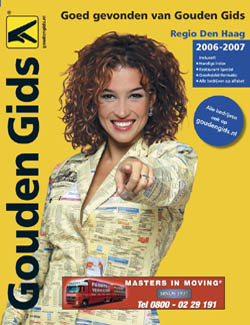
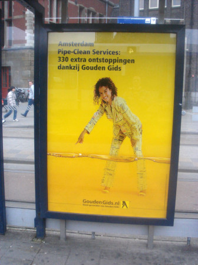

Je vous avais dit que [j'étais dans l'annuaire](/je-suis-dans-l-annuaire) mais j'ai oublié de préciser quel annuaire. Celui d'Amsterdam, celui avec **Katja Shuurmann** en couverture. Ici **les pages jaunes ont leur cover girl**, pas une jeune première, une actrice-chanteuse bien connue, pur produit cette  société multiculturelle néerlandaise. Katja Shuurmann est la fille d'un néerlandais et d'une femme de Curaçao. Elle a fait ses début dans une série télé pour jeunes en 1992. Elle a joué dans plus d'une vingtaine de films et de séries néerlandaises et a sorti plusieurs disques avec son groupe LR&J (Linda, Roos & Jessica) et en solo. En 2004 elle devient l'icône des **pages jaunes** (*Gouden Gids*) ce qui me permet de vous la présenter sans besoin de parler néerlandais. Voyez plutôt.

{.center}

{.center}

*Les couvertures des pages jaunes et des pages blanches en 2004, année du lancement du nouveau visuel. Katja Shuurmann, pose en costume pour les pros et en robe pour les particuliers.*

{.center}

> L'année suivant l'actrice fait toujours la une des pages jaunes. Cette fois Katja Shuurmann ne pose plus comme sur un magazine de mode mais indique ce qu'il y a de bien à l'intérieur de ces pages.

{.center}
> Nouvelle reprise d'un visuel de campagne pour la couverture de 2006. Katja Shuurmann en plan plus resserré

En 2004 les pages jaunes ont lancé cette nouvelle couverture, leur nouvelle icône Katja Shuurmann devait promouvoir le support dans [une campagne globale](http://www.sanaccent.nl/case/2005/katja). Son portrait en pied et habillée de pages jaunes se retrouvait sur les abribus et en 4x3 sur le bord des routes. On a vu l'actrice se matérialiser aussi dans plusieurs spots télé où, en bonne fée, elle aide les gens à trouver le bon numéro...

{.center}

Cette campagne était terminée quand je suis arrivée aux pays-Bas mais Katja Shuurmann était encore présente sur la couverture de mon bottin et sur les devantures des magasins. Un des objets publicitaires de la campagne était un panonceau ou les commerçants indiquent leurs horaires d'ouverture. Ce panonceau commence maintenant à disparaitre à son tour, mais ce n'est pas le seul. À son tour le bottin et ses pages jaunes, qui ont de moins en moins de pages chaque année est en train de disparaitre. Cette année, je ne l'ai pas reçu. Il semble que les pages jaunes ne soient plus la référence. L'édition papier ne sert plus puisque tout le monde a le nom des magasns les plus proches à porté de clic. Comme [le dit Tjan](http://kniesoor.wordpress.com/2007/01/15/katje_schuurman/), Katja est le chant du cygne des pages jaunes. Un départ en beauté.

<!-- HTML -->

<a href="/les-numeros-utiles" title="Les numéros de services au tarif normal">
<!-- / HTML -->
{.left}
**Les numéros de service NL**  
  
La liste des numéros directs vers les services téléphoniques les plus courants aux Pays-Bas.
<!-- HTML -->
</a>

<!-- / HTML -->
---
<!-- post notes:
http://www.robertpennekamp.nl/katjaschuurman.html 
http://kniesoor.wordpress.com/2007/01/15/katje_schuurman/ 
http://www.sanaccent.nl/case/2005/katja
--->
