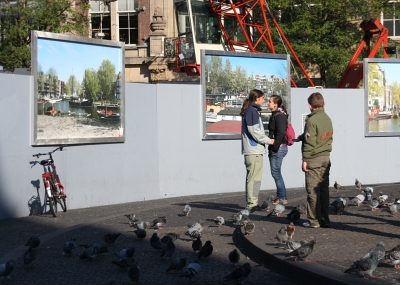

C'est une petite expo sans prétention qui a été posée sur la place du Dam depuis presque 5 mois. Encore une fois, ce sont les palissades de chantier de la future ligne de métro nord-sud qui sont décorés avec de grandes photos. **Dam** est largement fréquentée par les pigeons et les touristes. Ces derniers peuvent y découvrir des photos des canaux de la ville prises par beau temps ainsi que des photos de ...la place du Dam. Par temps de pluie, il est possible de faire le tour de la place puis de s'enfermer dans un musée avant de rentrer et raconter qu'on a fait le tour de la ville...

{.center}

Vous pouvez admirer le même genre de photos devqnt le parc des exposition de la ville **RAI**.
