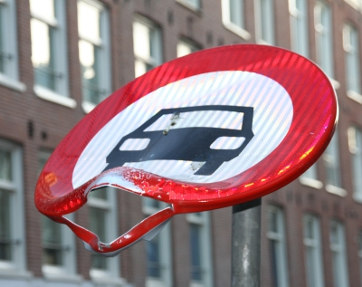
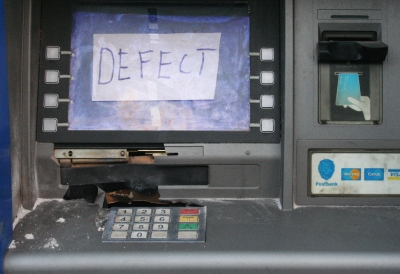
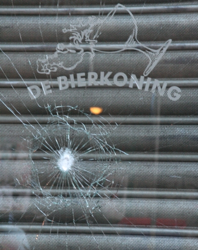
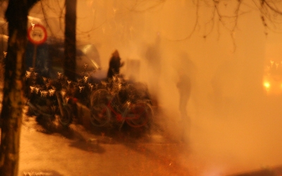

Je vais encore une fois revenir sur les évènements du jour de l'an de cette année. Après [les voeux](/meilleurs-voeux-nouvelle-annee) et le [comparatif des bonnes résolutions](/deux-nouvelles-annees), voici l'heure des bilans. Je ne ferais pas ici le bilan de l'année 2007, d'autres s'en sont chargé mais je vais parler ici du bilan de la veillée de la saint sylvestre avec pétards et incendies.

Quels ont été les dégats du nouvel an ? La police vient de les annoncer et ça fait peur. Dans tous les Pays-Bas il y a eu des incendies criminels et des milliers d'euros de dégats. Selon le résumé confus que [dresse libération](http://www.liberation.fr/actualite/monde/303179.FR.php), il y a eu 22 écoles brûlées aux Pays-Bas, c'est dingue. De là à dire comme Libération qu'il s'aggit d'*une nuit d?émeutes sans précédent* c'est un peu fort je pense. La brève de libé a d'ailleurs été reprise sur quelques blogs du front national parlant d'émeutes islamistes... J'ai aussi vu un blog parler des chiffres des dégats qui augmentait curieusement parce que certaines personnes en profitaient pour faire des arnaques aux assurances...

Le [Telegaaf parle de 11 milions](http://www.telegraaf.nl/binnenland/2929749/_Schade_jaarwisseling_11_miljoen**.html?p=5,1) d'euros de dégats selon les assureurs, en hausse de plus de 3 millions en comparaison avec l'année dernière. Ce dernier précise qu'il n'y a pas eu vraiment plus de voitures brulées mais que celles qui ont été brulées valent cette année plus cher.

Il y surement des arnaques aux assurances, du brigandisme d'occasion plus ou moins organisé mais rien qui ne justifie les hyperboles de la presse. Il reste que cette fête du jour de l'an et cette autorisation temporaire de l'utilisation des pétards génère beaucoup de vandalisme. Quelques images dans mon quartier me l'on rappelé à mon retour. En voici quelques photos :

<!-- HTML -->

<!-- / HTML -->
  
Beaucoup de panneaux sont le support de pétard trop puissants. Celui-ci a été changé en deux jours

  
Je ne sais pas si c'est un pétard qui a fait ça mais ça n'incite pas à retirer des sous.

  
Nul doute que la vitrine de ce marchant de bière a été fracturé dans l'espoir vain de se rincer le gosier

  
Cett photo date de l'année dernière, pendant [les bruits du nouvel an](/les-bruits-du-nouvel-an), on y retrouve une ambiance très *émeute dans le brouillard*

<!-- HTML -->

<!-- / HTML -->

Ce que les journaux n'ont pas raconté c'est la gestion de la foule par le police à Amsterdam. Le concert sur la place du Dam avait attiré tellement de monde que l'accès à la place a dut être fermé. Mais il a fallut faire en sorte de gérer les déplacement des personnes déçus dans les rues du centre ville en survellant l'accès des secours, de l'organisation du spectacle et tout. Cette information non sensationelle et anodyne a concerté plus de 50000 personnes dans la capitale alors que les quelques centaines de bagnoles qui ont brûlé dans la même nuit ne concernent que quelques de centaines de propriétaires non assurés.

**Quelques liens du nouvel an :__  
[Gueule de bois ?](/gueule-de-bois)  
[Préparatifs pétaradant](/preparatifs-petaradants)  
[Nouveau mot : Gelukkig](/liens-pour-nouvel-an)  
[Nouveau mot : Vuurwerk](/nouveau-mot-vuurwerk)  
[Un plongeon pour le nouvel an](/un-plongeon-le-nouvel-an)  
[Les bruits du nouvel an](/les-bruits-du-nouvel-an)  
[Ceux nouvelles années](/deux-nouvelles-annees)  
[Pour les vœux, c'est fini](/pour-les-voeux-c-est-fini)  
---
<!-- post notes:
http://fnvilleurbanne.hautetfort.com/archive/2008/01/12/bilan-de-la-saint-sylvestre-aux-pays-bas-22-ecoles-brules-pa.html 
$$Surement aussi quelques illuminés exercent des violences anti-système avec des motivations religieuses mais il me semble qu'il n'y a rien là qui justifie les propos de malades que j'ai lu ça et là.$$
--->
