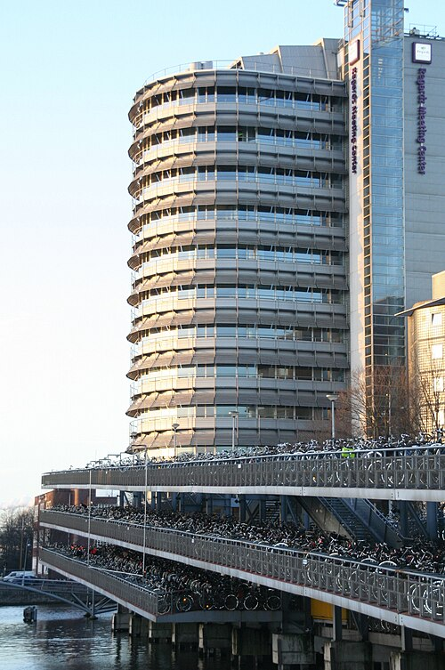
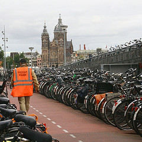

Pour le nouvel an, je suis allé en France en [Thalys](/tag/thalys/). J'ai pédalé jusqu'à la gare centrale (*Amsterdam Centraal Station*) et j'ai garé [mon vélo](/un-b-twin-a-amsterdam) dans cet immense parking jouxtant la gare. À mon retour deux semaines plus tard, il m'était impossible de remettre la main dessus.

[{.center}](http://commons.wikimedia.org/wiki/Image:Zilveren_toren_en_fitsflat.jpg)

## Nouveau mot : Fietsflat
Si on veut traduire ce nouveau mot littéralement, on dirait «appartement pour vélo» mais le terme ne semble pas très parlant, ce n'est pas un petit appartement douillet mais de véritables stalles ou [les bicyclettes](/tag/velo/) sont tassées les unes contre les autres. On peut garer 2500 vélos dans cette structure qui impressionné les touristes sortant de la gare centrale. 100 mètres de long et 14 mètres de large sur trois étages, le tout repose sur des pilotis en béton plongeant dans le canal. Cet ouvrage a été conçu par le cabinet d'[architectes VMX](http://www.vmxarchitects.nl) et à même été nominé en 2001 pour recevoir **le prix du Nederlands Architectuurinstituut**.

Inaugurée en avril 2001, ce parking à vélo provisoire devait offrir un solution au manque de place réservé aux vélos dus à la construction de la [Noord Zuidlijn](/la-ligne-du-nord-au-sud). Il devait être démonté en 2004 mais il est encore debout aujourd'hui. On avait même prévu de construite un deuxième *fietsflat* en 2006 mais le projet, trop coûteux, [a été abandonné](http://www.blikopnieuws.nl/bericht/23024). Du coup, même s'il reste des places dans quelques rues plus éloignées, ce parking est pris d'assaut et les vélos s'entassent dans les stalles Beaucoup d'entre eux sont glissés entre deux vélos à des emplacements qui ne sont pas de vraies places et les propriétaires des vélos voisins ont du mal à reprendre leur monture. Quand ils le peuvent, les gens bien garés déplacent le vélo fautif dans une autre place illégale, histoire de faire un peu rager son propriétaire. Le ministère des transports et voies d'eau annonce que quand les travaux seront terminés en 2012, 10 000 places de vélos seront disponibles en trois lieux autour de *Centraal Station*. On attend toujours.

[{.right}](http://flickr.com/photos/13274211@N00/1460208022/) Le parking est gratuit et il est gardé en permanence jour et nuit par des gardiens qui veillent régulièrement à ce que les allées soient au moins dégagées. Quatre fois par an, ils font le tour de tous les vélos du parking et y attachent des petites étiquettes oranges fluo. Le propriétaire est invité à y faire attention et à la retirer. Au bout d'un mois, tous les vélos qui ont encore une étiquette sont envoyés à la fourrière. Il y a à chaque fois un demi millier de vélos embarqués de la sorte, des gens qui ont perdu les clefs de leur vieux clou, d'autres qui partent en vacances un peu trop longtemps ou bien des gens qui perdent leur vélo dans ce gros tas de biclounes.

Les gardiens sont d'ailleurs très souvent mis à contribution par des personnes qui ne retrouvent pas leur vélo et qui veulent porter plainte pour vol. En fait, il est tout simplement difficile de retrouver sa bicyclette dans ce troupeau de selles et de guidons. Les gardiens conseillent de relever les numéros marqués au sol près des vélos ou de **prendre en photo leur emplacement avec leur téléphone**.

## Une heure de perdue
Quand j'ai pris mon Thalys, j'étais un peu pressé et je ne voulais pas rater mon train. Je savais qu'en me garant ici, il y avait un risque de ne pas retrouver mon b'twin (poutant tout propre et [révisé](/revision-du-btwin)) mais j'ai bien noté son emplacement dans ma petite tête. Seulement j'ai dû rebouter mes neurones en arrivant en 2008 et l'information a quitté ma mémoire vive. J'ai arpenté des dizaines de fois les allées de cette construction, en large et surtout en long, j'ai examiné des centaines de selles et de garde-boues, je ne voulais pas déranger les gardiens pour entendre des conseils que je connaissais déjà alors j'ai continué de tourner encore et encore dans les allées et les étages de ce parking. Finalement, ah# enfin, le voilà!

Lisez aussi l'[histoire des vélos morts](/le-temps-de-gate).
