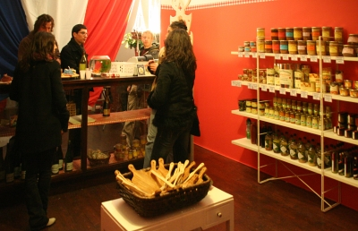
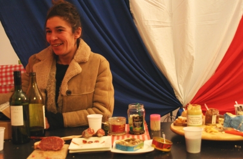

Amateurs de bon produits français et pourfendeurs de [la malbouffe](/le-lunch-du-midi), cette nouvelle va vous réjouir, une nouvelle boutique vient d'ouvrir sur [Albert Cuyp, la rue du marché](/albert-cuyp-le-marche). C'est la boutique de Sandra, la marchande de saucissons qui présente dejà ses produits sur le marché depuis deux ans.

Au début j'avais rencontré Sandra et acheté quelques saucissons sur son stand. Mais j'ai ensuite [trouvé un boulot](/de-mon-boulot) et comme Sandra n'est pas sur le marché Albert Cuyp le samedi, je n'ai pas eu l'occasion de venir lui dire comment c'était bien de pouvoir acheter du vrai saucisson sec ici; dans cette ville où presque toute charcuterie a un gout de malfumé.

Le samedi Sandra vends ses saucissons au Noordemarkt, un marché hebdomadaire autour de la Noordekerk. Comme c'est loin de la maison, je n'ai jamais eu l'occasion d'y aller. Voilà pourquoi je n'ai jamais eu l'occasion de vous parler de ce bon plan en ville. L'occasion m'en ai donné aujourd'hui puisque Sandra ouvre aujourd'hui une boutique dans la rue Albert Cuyp. Elle y vend plein de différentes sortes de **saucissons secs** bien sûr, mais aussi des **soupes de poisson**, des **pâtés** des **petits sablés**, des **sardines en boite**, de la **moutarde** et des **cornichons**, entre autres produits de nos terroirs de France. Si vous passez par là n'hésitez pas à visiter sa boutique qui vaut le détour.

{.center}

Samedi soir Sandra faisait sa première porte ouverte avec pots offerts aux visiteurs et discussion polyglote sur la bonne pitance. [Merci à Laurent](http://laurentchambon.blogspot.com/2008/02/une-grande-tape-de-franchie.html) de m'avoir indiqué ce bon plan où j'ai pu jouer au picassiette dans un cadre bien agréable. Voici donc quelques photos de ce début de soirée.

{.center} 

Maintenant il y a trois boutiques françaises sur Albert Cuyp, trois bonnes raisons de [venir régulièrement](/un-samedi-presque-en-france) sur ce marché.
