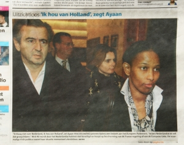

Vous avez tous lu **Bernard Henri Levy** apostrophant le président de la République dans une tribune de libération. Il propose de donner la nationalité française à **Ayaan Hirsi Ali** pour défendre la liberté d'expression.

Le problème d'Ayan Hirsi Ali n'est plus un problème de nationalité comme au moment de son départ mais un problème de sous. Le gouvernement ne veut pas (plus) payer sa protection quand elle se trouve à l'étranger. Or Hirsi Ali bosse aux States et doit trouver des sous pour assurer elle même sa protection. Elle essaye donc de faire du bruit pour soit faire plier le gouvernement de son pays, soit faire payer un autre gouvernement. Pourquoi pas la France... Bernard-Henri qui aime les causes qui font du bruit a donc décidé de s'engager derrière l'ancienne député Néerlandaise.

[Adresse à Nicolas Sarkozy à propos d'Ayaan Hirsi Ali](http://www.liberation.fr/tribune/2008/02/11/adresse-a-nicolas-sarkozy-a-propos-d-ayaan-hirsi-ali_64743) par Bernard-Henri Lévy, philosophe.

Il a invité pas mal de ses amis à ce faire de la pub à l'occasion ce qui a permis à l'évènement de bien porter. Libération en a fait [un dossier complet](http://liberation.newspaperdirect.com/epaper/viewer.aspx). Le débat est lancé... Dans le même libération, Pierre Marcelle évoque cette tribune dans son *No smoking* hebdomadaire. 

[Ça va durer encore longtemps ? Oui?](http://www.liberation.fr/tribune/2008/02/14/ca-va-durer-encore-longtemps-oui_65034) par Pierre Marcelle

En gros il commence à en avoir marre de voir BHL apostropher le président en public à tout bout de chant. Serait-ce uniquement pour faire parler de lui ? Si c'est le cas, ça marche plutôt bien puique voilà quelques jours plus tard le philosophe en couverture du journal *Metro* à Amsterdam... 

{.center}

L'article ne parle pas de BHL mais d'Ayan Hirsi Ali. Après sa visite en France, Hirsi Ali a poursuivit sa tournée Européenne en recherche de fonds. Elle a été reçue à Bruxelles au Parlement Européen et elle profite de sa venue en Europe pour s'adresser à qui veut l'entendre aux Pays-Bas : *Je vous aime*.
