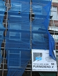
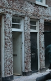
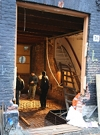

[{.left}](/public/images/photos/2008-01/travaux-sur-maison-protegee.jpg)
Depuis quelques mois il doit être difficile de faire la sieste pour les habitants de ma rue. Pas moins de sept chantiers y prennent place, des chantiers importants d'entretien des maisons amstelodamoises. A Paris les propriétaires redoutent d'avoir à engager les frais les plus important pour l'entretien de leur patrimoine alors ils surveillent l'état de la façade pour engager les frais le plus tard possible. 

Dans ma rue aussi il y a des ravalements de façade. Les maisons étant en briques, il ne s'aggit souvent que d'un coup de peinture. Parfois, la facade est grattée. Les échafaudages portent alors des toiles censées protéger le reste de la rue des emmissions de poussière. Mais les poussières se déposent malgré tout sur nos vélos garés en bas... Les joints entre les briques sont nettoyés et les parties endomagées sont retirés. De nouveaux joins neufs redonnent à la facade un air de neuf alors que les maisons de ma rue ont plus de cent ans.

[{.right}](/public/images/photos/2008-01/travaux-sur-maison.jpg)
A Amsterdam, le poste d'entretien le plus onhéreux n'est pas le ravalement de façade mais la reprise en sous-oeuvre des fondations. En effet, le sol de la ville est essencielement constitué de sable et la nappe phréatique n'est pas profonde. Les maisons s'appuyent donc sur des fondations qui reposent sur un sol meuble, au dessus de l'eau. Ceci expliue leurs façades légères et peu épaisses et leur hauteur limitées à quatre étages. Les maisons plus anciennes du centre-ville ne tiennent sur leurs fragiles fondations que parce que les murs sont maintenus ensemble par des tirants. Malgré tout cela, les fondations n'arrivent pas toujours à soutenir l'ensemble de la maison. cette dernière s'enfonce dans le sable. Il faut reprendre les fondation pour éviter que la maison s'écroule.

[{.left}](/public/images/photos/2008-01/travaux-dans-maison.jpg)
C'est l'objet d'un des chantier dans ma rue. la maison est littéralement vidée de ses occupants, meubles, cloisons et plancher. Pendant plusieurs jours je suis passé devant cette maison vide ou les ouvriers creusaient le rez de chaussée. Une pompe, placée sur le trottoir, évacuait l'eau qui remontait des profondeurs et l'envoyait dans le réseau de la ville. L'entreprise a ensuite occupé le trottoir avec des tonnes de tiges d'acier qui ont ensuité été positionnées dans les réservations sous la maison. Je n'étais pas là ce jour là mais la rue a due être bloquée pendant plusieurs heures quand les toupies de béton remplissaient les fondations. Des tonnes de béton pour faire tenir la maison.

* voir d'autres travaux dans mon quartier : [L'immobilier en hausse (encore)](/immobilier-hausse)
* et aussi [la maison rose](/cest-une-maison-rose) dans la même rue...
