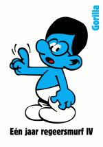
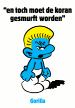
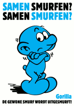
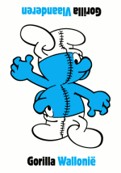

[Albert Hein](/albert-hein-et-compagnie) veut à nouveau nous rendre nostalgiques des années 80. Après [les wuppies](/qu-allons-nous-faire-de-nos-wuppies) en 2006 à l'occasion de [la coupe du monde](/on-est-en-finale), voici que **l'anniversaire des schtroumpfs** qui ont [50 ans cette année](http://happysmurfday.com/nl/nl/home), donne l'occasion au célèbre épicier de Zandam de nous offrir de nouveaux cadeau pour nous faire revenir dans ses magasins.

## Nouveau mot : smurf

Depuis la mi-février, chaque passage en caisse avec un panier de plus de 15 euros nous donne droit à un petit schtroumpf en plastique. Il y a quinze figurines à collectionner comme cela. Ici ils les appellent ***smurf***, comme chez les anglais. Mais aux Pays-Bas on connait les smurfs depuis le début parce que les aventures de Johan et Pirlouit ou sont apparut les petits nains bleus sont traduits en néerlandais depuis les années soixantes.

Albert Hein relance donc la mode des figurines bleues jusqu'au 25 mars. Ils ont pour cela fait fabriquer 29 milliards de figurines et comme toujours ils en font la publicité à la télévision.  Publicité ou le directeur du magasin habituel  (un grand chauve que j'ai du mal a trouver sympa) est dessiné et mis en scène dans un nouveau numéro du dessin animé des schtroumpf (version très bon marché).

<!-- HTML -->
<object width="425" height="355"><param name="movie" value="http://www.youtube.com/v/3sWBaxhnhoU"></param><param name="wmode" value="transparent"></param><embed src="http://www.youtube.com/v/3sWBaxhnhoU" type="application/x-shockwave-flash" wmode="transparent" width="425" height="355"></embed></object>
<!-- / HTML -->

Les **29 milliards de figurines schtroumpf** que les clients se battent pour avoir aux caisses ne sont pas de bonne qualité, c'est le moins qu'on puisse dire. Elles n'ont rien à voir avec les figurines Schleich de notre enfance. Plus petites, elles sont aussi pointues et cassantes. Nombre de mes collègues ont cassé leur smurf et déjà les clients reviennent au magasin pour se plaindre. Les figurines sont données dans des emballages indiquant qu'elles ne conviennent pas aux enfants de moins de 3 ans , je trouve que c'est du foutage de gueule de distribuer des jouets avec lesquels on ne peut pas jouer. [De Pers parle de ce problème](http://www.depers.nl/binnenland/176447/29-miljoen-blauwe-brekebeentjes.html) mais la chaîne de magasin continue l'opération.

## Gorilla copie Peyo

Le petit dessin (ou infographie) humoristique à la une du Volkskrant est signé [Gorilla](http://extra.volkskrant.nl/gorilla/). Gorilla, sûrement inspiré par l'opération de AH, dessine maintenant des Schtroumpfs (smurf). Il a commencé samedi avec le premier ministre en Schtroumpf à lunettes (brilesmurf). Les personnages suivants sont moins conventionnels le vous les présente ci-dessous.

<!-- HTML -->
<table><tr><td>
<!-- / HTML -->

<!-- HTML -->
</td><td>
<!-- / HTML -->

<!-- HTML -->
</td><td>
<!-- / HTML -->

<!-- HTML -->
</td><td>
<!-- / HTML -->

<!-- HTML -->
</td></tr></table>
<!-- / HTML -->

Pour ceux qui, comme moi, ont des problèmes avec le néerlandais, il faut un dictionnaire pour savoir qui est *Wintersmurf* ou *Lachende smurf* je vous conseille [cette page](http://miniatuurfiguren.be/smurfstabel.html) qui semble exhaustive...
---