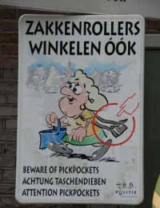
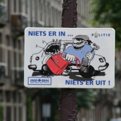
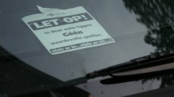

Amsterdam est une ville touristique et ces derniers souvent nonchalands et bien chargés sont une cible idéale pour les pickpockets. La mairie d'Amsterdam essaye de limiter le nombre de victimes avec un dispositif policier concéquant mais aussi par une prévention dont je ne sais pas si elle est efficace.

### Les films dans le tram
Les trams modernes sont équipés de vidéos pour la pub entrecoupés d'écrans d'information générales pour attirer l'attention. La Régie municipale GVB a réalisé un petit film montrant la façon de faire des voleurs à la tire (pickpockets). Il passe régulièrement dans les trams et montre que les pickpockets agissent souvent au moment de l'entrée dans le tram ou une bousculade est naturelle. Trop tard donc mais on saura pour la prochaine fois...

### Les panneaux dans la rue

[{.center}](/public/images/photos/2008-04/panneau-zakkenrollers-winkelen-ook500.jpg)

Dans la rue aussi on rappelle aux passants qu'ils peuvent être la cible de vols à la tire et qu'il convient de fermer ses sacs et de faire gaffe à leurs contenu. L'illustration n'est pas shématique du tout et représente une grand-mère distraite même si elle s'adresse à tous les passants. Je ne sais pas si ce panneau est efficace mais en tout cas il est rigolo. *ZAKKENROLLERS WINKELEN OOK* (Les voleurs aussi font leur shopping)

[{.center}](/public/images/photos/2008-04/panneau-niets-er-in55carre500.jpg)

Le deuxième panneau aussi est rigolo, il représente un vol à la roulotte commis par un méchant voleur, même qu'on voit qu'il est méchant puisqu'il est mal rasé et qu'il a une casquette de ladron. La légende est peut être plus claire: *NIETS ER IN, NIETS ER UIT* (rien dedans, rien dehors). Tant pis pour les non-néerlandophones, ils comprendront plus tard qu'il est préférable de ne rien laisser dans sa voiture si on se gare à Amsterdam.

### Prévenir les voleurs

Le police met aussi à disposition dans ses commissariats des petits panneaux à accrocher sous son rétroviseur permettant d'indiquer aux voleurs qu'il n'y a rien dans la voiture. Nombre de personnes ont découvert ce panneau au moment, pénible, de déclarer un vol à la roulotte. Encore une fois c'est trop tard. Les victimes apprennent à leurs dépends qu'il ne faut rien laisser dans sa voiture où que l'on soit en voyage. On en voit qui affichent ce panneau dans leur voiture. Plus qu'une mise en garde pour les voleurs, c'est un pense bête pour les conducteurs.

[{.center}](/public/images/photos/2008-04/let-op-geen-waardevolle-500.jpg)

* voir aussi [Petits vols en public](/petits-vols-en-public) (1) et [Petits vols en public](/petits-vols-en-public-2) (2). Que fait la police?
