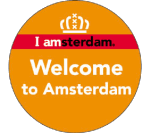
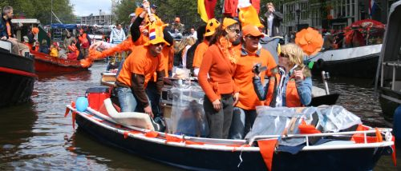
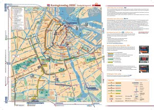
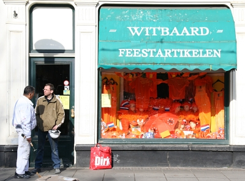

{.left}
C'est cette année ma troisième fête de la Reine. Si en 2006 j'ai été surpris par l'évènement, je regarde cette année les préparatifs comme un rituel. Je vous ai déjà beaucoup parlé de cette fête et je sais que ce n'est pas fini. Pour le moment je vais vous en présenter le programme officiel telle qu'il nous est proposé à Amsterdam.

## Les koninginnerdag précédents

En 2006, une sortie [sur les canaux](/pas-de-fete-du-travail) et la foule en orange m'a tout juste permis de vous montrer [la foule des gens oranges en délire](/koninginnedag). Je vous réoriente vers ces photos et surtout [ma collection de chapeaux](/hoeden). Le 30 avril, la ville devient un carnaval géant. Je vous ai ensuite présenté les [préparatifs en orange](/preparatifs-oranges) de l'année suivante avec les gens qui [marquent *bezet* dans la rue](/nouveau-mot-bezet) pour réserver un bon emplacement. Le 30 avril, la ville devient une brocante géante.

[{.center}](/pas-de-fete-du-travail)

## Les transports

Avec le monde qui converge vers le centre-ville, les transports sont quelque peut chamboulés. Les services transports de la mairie diffuse donc [les informations](http://www.bereikbaar.amsterdam.nl/live/main.asp?name=nieuws&item_id=NL_AMS_IVV_100000000744) sur les lignes de trames qui sont supprimées et les possibilités de parking. Vous venez [en train](http://www.bereikbaar.amsterdam.nl/live/main.asp?action=display_data&name=nieuws&item_id=NL_AMS_IVV_100000000745), [en tram ou bus](http://www.bereikbaar.amsterdam.nl/live/main.asp?action=display_data&name=nieuws&item_id=NL_AMS_IVV_100000000746), [en voiture](http://www.bereikbaar.amsterdam.nl/live/main.asp?action=display_data&name=nieuws&item_id=NL_AMS_IVV_100000000747) ([en voiture et en francais](/pour-ceux-qui-viennent-nous-voir-en-voiture)), on vous explique tout mais en Néerlandais uniquement... Les personnes qui viennent à vélo peuvent toujours utiliser les infos [diffusées en 2006](http://www.noordzuidlijn.amsterdam.nl/live/main.asp?action=display_data&name=nieuws&item_id=NL_AMS_IVV_100000000255), on n'a pas pensé à eux cette année.

La circulation fluviale aussi est chamboulée, l'année dernière, un bouchon sur les canaux a gâché la fête à certains et cette année on se dit que ça ne se renouvellera pas. Le canal des brasseur est fermé et un sens de circulation est instauré sur le canal des princes. [Les explications sont ici](http://www.bba.amsterdam.nl/alle_nieuwsberichten/nieuws_pleziervaart/aangepaste) dans la langue des navigateurs.

[{.right}](http://blog.re/me-in-amsterdam/files/data/koninginedag2008_kaartzijde.jpg) Enfin le gros de la circulation étant piétonne, les transports publics distribuent une carte avec les itinéraires piétons recommandés et surtout les lignes de tram qui restent en service. Cette carte est en ligne et vous permettra de choisir votre programme et de vous trouver dans le bon quartier.

## Le programme

Cette fête n'est effectivement pas un défilé orange spontané tel qu'il pourrait apparaître au premier abord. Chaque tranche de la population se voit proposer des activités. en voici quelques unes pour Amsterdam. Il faut savoir que la fête commence la veille, le 29 avril au soir s'appelle la *Konninginnenacht* (nuit de la reine) et le moindre petit café bar en profite pour organiser une soirée spéciale ou fermer. Il y a aussi de grosses soirées organisées souvent en plein air avec des DJ invités pour l'occasion. Je peux conseiller le [TWSTd QNSNGHT](http://twstd.nl/?p=agenda&s=item&ID=328) sur Weteringcircuit ou vous signaler la [fête 99% hollandaise](http://www.woodys.nl/) du Woody's sur Thorbeckeplein, le concert [T dansant](http://www.tdansant.nl/) sur Waterlooplein. J'en connais qui passent la soirée a faire la tournée des bars pour y boire de *Genever*, le Gin local.

Après pareille nuit, le lendemain commence un peu tard, sauf pour les marchands d'un jour qui préparent leurs stands depuis le matin et prifitent du *Vrijmarkt* (le marché libre). C'est dans le centre ,ais aussi dans les quartiers plus tranquiles comme tout près de ches moi sur Roeloof haartplein ou autour de Oosterpark. Quand au Vondelpark, il est entièrement dédié aux enfants. Des activités pour les enfants y sont organisées mais on retrouve aussi ces mêmes enfants se faire de l'argent de (grosse) poche en vendant leurs vieux jouets, des pâtisseries et autres babioles.

Une fête foraine a été installée sur la place du Dam, elle est là pour la fête de la reine et ne sera pas démontée tout de suite après. Les gens de passage pourront en profiter s'ils veulent mais je conseille aux autres d'y aller un autre jour pour moins faire la queue.

L'heure de pointe est assurément dans l'après-midi. Les défilés oranges sont les plus intéressants sur les canaux du centre ville, et près de Jordan mais en fait la fête se passe partout. De grands concerts en plein air sont organisés en partnariat avec les grosses radio du pays. Radio 538 est sur Museumplein, SLAM FM est sur Rembrandtplein et les chansons hollandaises sont toujours sur Thorbeckeplein avec la radio 100% NL. Pour le programme il devrait être annoncé sur le site de chacune de ces radio et dans la presse locale.

Le quartier extérieurs d'Amsterdam organisent aussi des fêtes, des concerts et des brocantes sur les places et dans les parcs. On peut noter [un tournoi d'echecs dans le Barsjes](http://www.hetprobleem.nl/joomla/index.php?option=com_content&task=view&id=137&Itemid=1), un festival avec de la musique latino à Oosdorp.

## Quel temps fera-t-il ?

Cette question est importante pour savoir si on soit mettre un anorack orange ou un débardeur orange... A l'heure ou j'écris ces lignes, il n'en ai aucune idée mais si, comme moi vous surveillez le *koninginnedagradar* [radar de la fête de la reine](http://www.koninginnedagradar.nl/?id=18), vous en aurez une idée précise le moment venu.

[{.center}](http://www.flickr.com/photos/13274211@N00/2454265946/)
<!-- HTML -->

<i>À votre avis, c'est pour bientôt la fête de la reine ?</i>

<!-- / HTML -->
---
<!-- post notes:
http://kunst-en-cultuur.infonu.nl/feestdagen/4099-koninginnedag-programma-amsterdam-2008.html 
http://www.amsterdam.nl/?ActItmIdt=122749 
http://www.amsterdamtourist.nl/en/home/events/article/xp/content_artikel.Eventsalg+-+75QueensDay2008/default.aspx 
 
2006
http://www.noordzuidlijn.amsterdam.nl/live/bijlagen/bereikbaaramsterdam/figuren/uk/nieuws/plattegrond_kaart.pdf
--->
