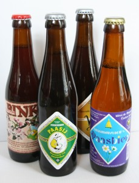

Je vais encore vous parler de Pâques et vous allez me répondre qu'il s'aggit là d'un sujet en retard encore une fois... Que nenni, la période de Pâques, *Tempus Paschale*,  selon [le calendrier liturgique](http://www.liturgiecatholique.fr/Nouvel-article,1149.html), se termine à la Pentecôte, c'est à dire 50 jours après Pâques. J'ai donc tout le temps pour vous parler encore de Pâques sans être en retard. 

[{.left}](http://commons.wikimedia.org/wiki/Image:Bieres-de-paques.jpg)
En fait, je vous lais juste vous faire part de ma petite découverte brassicole de ce temps pascal: **la bière de Pâques**, ou *Passbier*. Je connaissais la bière de Noël ou la bière de mars mais il semblerait que toutes les occasions soient bonnes pour sortir des bières spéciales. C'est évidement une invention que l'on doit à des micro-brasserie que cette bière de Pâques. Pendant que les grand brasseurs se rachètent les uns les autres et uniformisent le goût de la bière (voir à ce sujet [les brasseries Néerlandaises](/les-brasseries-neerlandaises)), de nombreuses brasseries artisanales créent de nouvelles bières par passion. Sur la photo ci-contre, deux bouteilles de Passebier et deux bouteilles de bière spécial printemps. Deux d'entre elles sont brassées en Belgique mais deux autres sont brassées par la **brasserie 't IJ** établie à Amsterdam. La bière *passebier* belge a une très bonne amertume toute houblonnesque tandis que la bière *passij*, plus forte et plus douce à la fois, révèle des parfums presques fruités sous une mousse abondante. Toutes deux ont été le parfait brevage de **mon troisième dimanche de Pâques**.

Je vous parlerais prochainement de la brasserie 't IJ établie à Amsterdam. Pour le moment, je dois vous laisser pour déguster les autres bières...

... et d'[autres encore](http://www.biere-valmy.fr/).
---