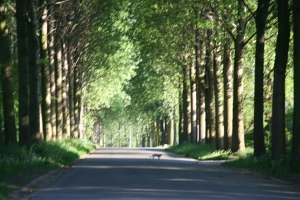
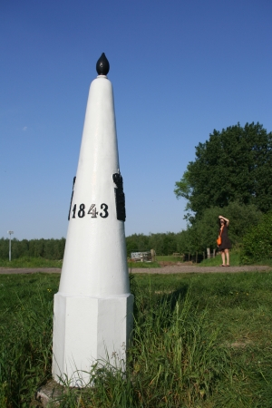
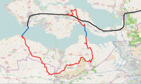

Un de ces derniers week-end, nous sommes allés [en Zélande](/les-provinces-des-pays-bas), en Flandre Zélandaise pour être plus précis. Cette petite région que les Néerlandais appellent **de l'autre coté** (*de andere kant*) est la seule du pays située au sud de l'Escaut. Pour s'y rendre le plus rapidement, il faut passer par la Belgique, le ring d'Anvers. Cette partie du ring traverse la campagne, le gros port d'Anvers et nous fait descendre dans d'impressionants tunnels à plus de 5 euros le passage.

Comme le montre [cette carte](http://maps.yahoo.com/#mvt=m&lat=51.265328&lon=4.068298&zoom=12&q1=moerdijk%20NL&q2=westdorpe%20NL&w0=51.228387892306834%2C3.8397216796875), on doit ensuite rouler un petit moment en Flandre avant de remonter aux Pays-Bas. Ce petit bout de province isolé du reste du pays ne compte que trois communes pour quelques 107000 habitants. Dans ce coin, flamands et zélandais traversent allègrement la frontière pour aller à la plage ou faire leurs courses, ils n'ont pas de problème de langue. Leur accent même; est presque similaire surtout pour ceux qui sont familiers de l'accent d'Amsterdam...

{.center}

**Mais alors ? pourquoi deux Pays ?**

Les frontières actuelles de la Belgique datent du Premier Empire. A l'époque le Benelux fait partie de L'Empire de Napoléon mais à sa chute; en 1815, l'ensemble devient Royaume des Pays-Bas. Le sud de ce nouveau royaume, à majorité catholique avait une histoire quelque peut différente des Provinces-Unies du nord et ne s'entendait pas avec un Guillaume III d'Orange très despotique. Le soulèvement des Belges est inévitable et a lieu en 1830. L'indépendence de la Belgique est proclamée le 4 octobre 1830. La Zélande, à [majorité protestante](/catholiques-et-protestants), ne suit évidement pas le mouvement belge et reste aux Pays-Bas. Les hollandais sont trop contents de conserver la mainmise sur l'Escault occidental (*Westerschelde*), seul accès maritime pour le port d'Anvers de celui de Gand même s'ils n'ont jamais osé bloquer la route maritime des belges. Cet état de fait leur permet de tirer parti de l'activité maritime belge en percevant un droit de passage mais ceci les oblige aussi à draguer régulièrement les fonds de cet estuaire pour entretenir les chenaux ou passent les énormes bateaux.

{.center}
*Borne frontalière entre la Belgique et les Pays-Bas*

Il y a donc une longue frontière sinueuse séparant les deux pays d'est en ouest. Cette frontière fut marquée jadis par des bornes le lion Flamand au sud et le lion Néerlandais (brandissant une épée) au nord. Aujourd'hui, les accords de Shengen nous permettent de passer d'un coté et de l'autre sans être ennuyé par un quelconque douanier. On pourrait presque ne pas s'apercevoir qu'on vient de changer de pays si quelques détails ne nous rappelait pas les différences entre les deux Pays. Après 15 minutes de promenade, le premier village rencontré contraste avec le village propret et bien alligné que l'on vient de quitter en Zélande. Les maisons sont ici de toutes les couleurs et sans vraiment d'unité architecturale. Ici, on voit sur les tables des terrasses de verres en forme de tulipe prouvant qu'ici on préfère boire de la Duvel plutôt que de la Heineken. C'est une raison suffisante pour s'arrêter prendre un verre. Regarder les drapeaux trop jaunes pour être bataves et raconter des blagues sur ce peuple qui a du mal a s'entendre avec lui même.

En fait, la querelle linguistique des belges est plutôt récente, elle suit la pente inverse de la déchristanisation. 2008 est l'année des disputes sur le BHV mais c'est aussi l'année anniversaire (40 ans) des émeutes de Louvain (*Leuven*) où les étudiants francophones ont été chassés de cette ville flamande. La Belgique s'est construite contre les Pays-Bas et après avoir souffert de la première guerre mondiale elle s'est aussi construite contre l'Allemagne. L'alliance militaire avec la France de l'entre-deux guerre semblait donc logique. Ce soutient français et cette présence qui s'appuyait sur la bourgeoisie francophone n'a pas été très appréciés des flamands et ont peut dire que c'est à ce moment là que leurs revendications linguistiques et régionales sont nées.

**Mais alors, Pourquoi pas deux Pays ?**

Les développements récents des querelles linguistiques et les problèmes rencontrés à la création du gouvernement Letherme ont été largement décriées en France comme aux Pays-Bas. Pourtant, aux Pays-Bas aussion a aussi l'habitude des [longues négociations avant la création d'un gouvernement](/la-formation-du-gouvernement). On a entendu quelques français souhaiter acceuillir la Wallonie dans la république et c"est maintenant aux Pays-Bas de proposer à recevoir la Flandre dans leur royaume[^1]. L'idée vient de Gert Wilders, probablement l'homme politique qui fait le plus parler de lui sans n'avoir jamais dit une une seule chose intelligente. Je doute que les Flamands soient disposés à se jeter dans les bras de leurs ennemis d'hier.

### Pour en savoir plus
{.left}
Je suis retourné dans la région lors d'une boucle à vélo. Cela m'a permis d'écrire trois article sur cette région venteuse mais pas seulement, que traverse l'estuaire de l'Escault.

* [Voyage en Zélande : Un petit tour à vélo](/a-nouveau-en-zelande)
* [Voyage en Zélande: Traverser l'Escaut](/voyage-en-zelande-traverser-l-escaut)
* [Voyage en Zélande: L'indépendance de la Belgique](/voyage-en-zelande-l-independance-de-la-belgique)

---
[^1]: voir [Un populiste Néerlandais veut annexer la Flandre](http://www.fenetreeurope.com/php/page.php?section=actu&id=11231) et aussi la [jolie carte irrédentiste de Nérlande](http://ecolonews.blog.fr/2008/05/13/geert-wilders-encore-4166953)
<!-- post notes:
Westerscheldetunnel 2003
--->
