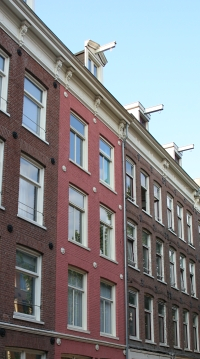
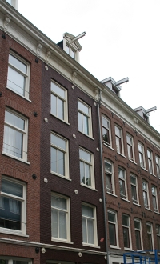

Les maisons de ma rue sont souvent en travaux certes. Leur autre
particularité est d'être plus ou moins identiques. Elles ont toutes été
construites entre 1903 et 1908 sur le même modèle : facades étroites
(pièces toutes en longueur) avec deux portes et de larges fenêtres sur
quatre étages surmontées d'un toit avec un petit chien assis et son
[inévitable crochet](/de-haak-crochet).

Cela donne à la rue un jolie trame répétitive typiquement
Amstelodamoise. Certains trouvent cela trop monotone d'où l'idée de
quelques propriétaires de peindre leur maison en rose. Le ton ne jure
pas et se fond bien dans la rue mais hélas cette couleur n'est pas
autorisée. On n'est pas à Curaçao que diable...

La mairie veille à ce que le quartier garde les caractéritiques qui ont fait sa réputation. On parle du Pijp comme du *quartier latin* de la ville[^1]. Les services de la mairie sont donc très tatillons sur l'aspect des maisons et n'accordent pas toujours les permis de contruire ou de modifier un bâtiment. La mairie est beaucoup moins tatillonne quand il s'aggit de conserver la spécificité sociale du quartier. Elle encourage les projets de promotion immobilière, réduit le nombre d'habitats sociaux et ne fait rien pour freiner l'[envolée du prix des logements](/immobilier-hausse). Les ouvriers et les classes populaires qui ont rendu ce quatrtier attrayant ont de moins en moins les moyens d'y vivre et ils s'en vont ailleurs laissant la place à des ménages plus riches. Les jeunes bobos aiment bien l'esprit populaire du quartier mais ils le font disparaître en s'y installant. 

{.left}
La mairie n'essaye donc de conserver que le décors d'un théatre dont la pièce se joue déshomais ailleurs. Elle encourage la venue de ces ménages plus riches qui dépensent plus dans les commerces locaux et qui payent plus d'impots. Seulement ces ménages, avec leurs impots et leur niveau d'éducation plus élevés ont aussi des exigeances plus élevées. Les propriétaires repeignent leur maisons et ce n'est pas de petits fonctionnaires d'arrondissement qui vont leur expliquer comment choisir la couleur...

Voici donc que dans ma rue une jolie maison typique du quartier a fait l'actualité parce que son propriétaire, Monsieur Smithuis, a décidé de repeindre la facade en rose. La mairie n'a pas aimé ce changement de couleur mais le propriétaire n'a pas voulu la changer.  C'est donc devant les tribunaux que cette affaire c'est réglée. La longue et surement coûteuse procédure a même interessée les médias, [AT5](http://www.at5.nl/media/at5nieuws_item.asp?newsid=34116)  et [Haart van Nederland](http://www.hartvannederland.nl/item/7407/) sont venus, caméra au poing, visiter Saenredamstraat et la maison de la famille Smithuis. Il a fallut 5 ans de procédure pour donner raison à la mairie et contraindre le propriétaire de repeindre sa maison en marron.

Pour fêter la fin des aventures de la maison rose, les habitants ont organisé une **house browning party** dimanche dernier où tous les gens du quartier étaient invités. Les premiers coups de brosse ont été appliqués sur le mur pour y laisser des messages à l'adresse de la mairie. Après quoi, les voisins ont partagé du champagne rosé et du jus de pigeon dans une belle ambiance dominicale.

[{.center}](![)(house-browning-party.png)]

{.right}
Le mardi suivant, une platte-forme est arrivée sur le trottoir et les peintres ont terminé le travail du dimanche en repeignant la maison dans un marron réglementaire. La maison est désormais un peu plus sombre dans la rue et de toutes façons on n'y reste pas pour regader les maisons, parce qu'il s'est remis à pleuvoir. Ma rue est une jolie rue, il y a [souvent des travaux](/des-travaux-dans-ma-rue) de toutes sortes mais elle vaut une petite visite. Si vous passez par là, vous verrez au 51 de la Saenredamstraat, une maison à la facade marron. Si vous croisez les habitants et que ces derniers parlent de *la maison rose*, souvenez-vous de cette histoire et admirez la facçade.

* voir aussi [la maison des années 20](/la-maison-des-annees-20)
---
[^1]: Cette appelation pompeuse, en référence au quartier homonyme de Paris qui ne lui ressemble pas, est parait-il due au fait que jadis beaucoup d'espagnols, le plus souvent des ouvriers, habitaient ce quartier... ce n'est plus le cas depuis longtemps.
<!-- post notes:
http://www.at5.nl/media/at5nieuws_item.asp?newsid=34116 
http://www.hartvannederland.nl/item/7407/
--->
