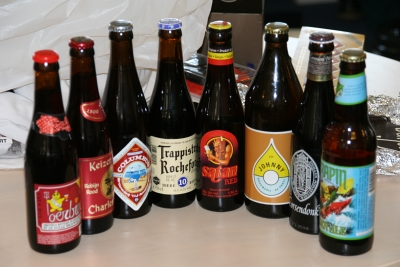

Hier j'ai appris une nouvelle chanson en néerlandais voici ce que ça donne :

## Er is er een jarig

Er is er een jarig, hoera, hoera  
Dat kun je wel zien dat is hij/zij  
Dat vinden wij allen zo prettig ja ja  
En daarom zingen wij blij  
Hij/zij leve lang hoera hoera  
Hij/zij leve lahang hoera hoera  
Hij/zij leve lang hoera hoera

## Explication de texte

*Il y a un anniversaire ici hourra hourra*   
''On voit bien aue c'est le sien/la sienne*   
*Et on le/la trouve bien joli(e) oui oui''  

Bon ça veut dire qu'en général la personne dont c'est l'anniversaire est affublé d'un chapeau ridicule mais comme tout le monde chante en son honneur, il est très content de son chapeau. Je ne vous montrerais pas la chapeau ridicule que j'ai du porter hier alors que personne ne chantait...

''Qu'il/elle vive longtemps hourra hourra*   
*Qu'il/elle vive longtenhemps hourra hourra*   
*Qu'il/elle vive longtemps hourra hourra''   

Vivre longtemps, c'est une constante des chansons d'anniversaire ici, ponctué de hourras enconrageants. Souvenez-vous des parloles de cette autre chanson  que [je vous ai appris il y a un moment](/un-anniversaire-a-amsterdam). Plus les gens vivent longtemps plus on a de chances de chanter c'est chansons. C'est génial non ?

## Et les cadeaux ?

Coté cadeaux aussi c'est génial, les collègues se sont cotisés pour m'offrir la photo ci dessous. Je ne sais pas vraiment quelle réputation j'ai au boulot mais comme cadeau, c'est  génial non ?

{.center}

* Souvenirs: [Il y a deux ans déjà](/photos-du-pic-nic) (mais non je ne suis pas vieux...)

<!-- HTML -->

<!-- / HTML -->
J'en profite pour remercier tout le monde, Sophie, Fred, Anne et Ben, Solange, Clotilde, Anand, Nick, Susannah, Sandra, Chris, Fergal, Miguel, Adrian, Camilla, Ray, Rob, Marion, Ingrid, Emmanuel, Claudia et meme les retardataires, maman, Romain, Ismini
<!-- HTML -->

<!-- / HTML -->
---
<!-- post notes:
http://nl.wikipedia.org/wiki/Er_is_er_een_jarig
--->
