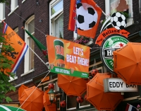
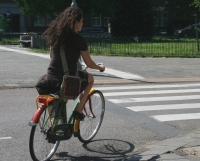

Pour justifier mon peu de productivité de ce blog ces derniers mois j'ai donné [quelques liens](/en-vrac-et-sur-le-web) en disant que je passais beaucoup de temps sur ces pages web. Comme il y a une vie en dehors de l'écran, je vais maintenant vous parler des choses qui se passent en dehors du grand ternet.

**Le hareng nouveau est à arrivé**  
Comme tous les ans le drapeau des Pays-Bas se hissent devant toutes les poissonneries qui vantent le *Hollandse Nieuw* Ce [harang nouveau](/de-hollandse-nieuwe-haring) qui n'a de frais que le nom puisqu'il est mariné et congelé sur les bateaux de pêche. Il est quand même très bon et je prends plaisir à en manger. Voir [les photos](/hollandse-nieuwe-haring-photos) de l'année dernière.

{.right}
**La folie orange**  
Cette année les drapeau du *Hollandse nieuw* ont une forte concurence avec les tonnes de décorations oranges devant les cafés et dans les vitrines de nombreux magasins. [La presse souligne](http://www.ambafrance.nl/spip.php?article9784) que de plus en plus de Néerlandais s'interessent au foot. Le fait d'être devenu le pays favoris en trois match y fait sûrement quelque chose.

**Nouvelle adresse**  
Dans deux semaines nous allons déménager pour un appartement. Nous avons acheté un appartement dans notre quartier actuel que nous aimons bien. Nous avons finalement décider de profiter des [avantages fiscaux](/credits-pays-bas) de la propriété malgré un [marché immobilier](/des-nouvelles-de-l-immobilier) à tomber sur la tête. [La signature](/signatures-week) est pour début juillet et j'aurais peut-être le temps de revenir là dessus.

{.right}
**Nouveau vélo et Nouvelle selle**  
Ces derniers temps il y a beaucoup de jours de beau temps (pour Amsterdam, c'est à dire qu'il pleut au moins une fois par semaine) alors [les gens en profitent](/revisions-sous-le-soleil). S. profite aussi du soleil et utilise son nouveau vélo hollandais[^1] de temps à autre. De mon coté, j'ai du [encore réviser le mien](/revision-du-btwin), (toujours le [b'twin](/un-b-twin-a-amsterdam)) et remplacer la selle. La selle d'origine était ouverte et laissait échapper le gel qui la constituait... beurk!
---
[^1]: J'ai fait une [jolie photo de son vélo ici](/plein-de-velos-hollandais) (Plein de vélos hollandais)