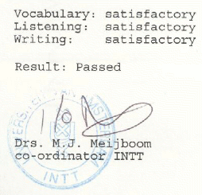

Parmi les occupations qui m'ont empèché de mettre mon blog à jour régulièrement, il y a les cours de langues que j'ai pris durant quatre mois à l'Université d'Amsterdam (UVA). Il faut que je vous en parle parce que je viens de recevoir les résultats de mon examen.

Ces cours plutôt intensifs étaient dispensés à la faculté de sciences humaines (*Faculteit der Geesteswetenschappen*) par un service appelé [INTT](http://www.hum.uva.nl/intt/home.cfm) pour *Instituut voor Nederlands als Tweede Taal* (Institut de néerlandais seconde langue).

Le manuel de cours est très bon, il s'appelle [CODE 1](http://www.nl.bol.com/is-bin/INTERSHOP.enfinity/eCS/Store/nl/-/EUR/BOL_DisplayProductInformation-Start?Section=BOOK&BOL_OWNER_ID=1001004002073274) et est vendu avec un cédérom indispensable pour faire les exercices de compréhention orale. Chaque chapitre couvre un thème de la vie courante ce qui nous fait apprendre des phrases utilisables dans la vie de tous les jours. Si le livre s'appelle CODE 1, c'est qu'il y a plusieurs volumes dans la série et que celui-ci est réservé aux débutants.

Pour débutant que nous étions je trouve qu'on nous a bien bourré le --mou-- crâne avec ces cours pour le moins intenssifs. Ils consistaient en trois heures de cours le soir, deux fois par semaine ainsi que d'une tripoté de devoirs à la maison qui prennaient de plus en plus de temps et des listes de mots et des règles de grammaire à apprendre. A la fin, pour faire tous les devoirs il fallait investir cinq heures suplémentaires à la maison et c'est pour celà que je me suis découragé avant la fin.

[{.left}](http://blog.re/me-in-amsterdam/files/data/toets-uva.pdf)

Les deux dernières semaines de mai, j'ai laché l'affaire. Avec tout le boulot que j'avais, je n'avais pas le temps de réviser ni de faire mes exercices. J'ai donc décidé de ne plus bosser, de profiter un peu du peu de soleil et de n'aller à l'examen que pour m'entrainer pour la session de ratrapage. En fait l'examen était facile. Bon, pour ce qui est du vocabulaire j'ai quand même mis la moitié des mots au hazard dans les cases mais il faut savoir compter sur la chance des fois. Résultat, **je suis reçu** avec un niveau satisfaisant (au moins 70% de réponses correctes) et j'ai maintenant le niveau officiel de débutant. Ce qui veut dire que des fois je comprends ce qu'il se passe mais pas toujours et de toutes façons je ne peux toujours pas m'exprimer.
---