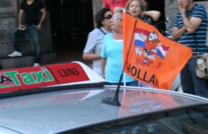
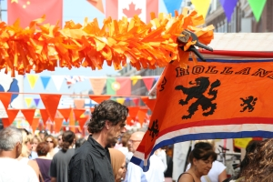
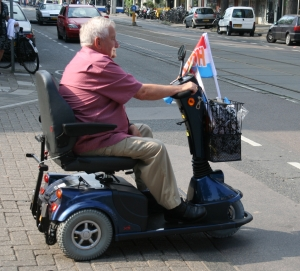
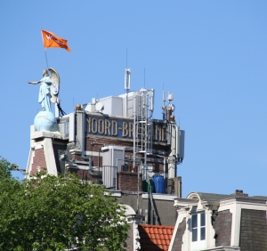
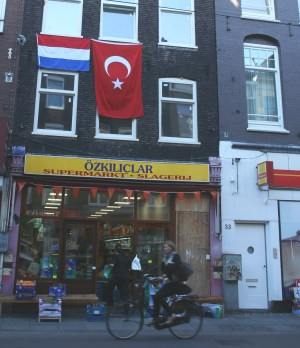

Aujourd'hui encore, comme chaque jour que l'équipe néerlandaise de football joue à cette coupe d'Europe, les gens s'habillent et décorent en orange comme à [la fête de la reine](/la-fete-de-quelle-reine). Mieux encore, des drapeaux s'accrochent de partout. Ce ne sont même pas des [drapeaux officiels](/le-prinsenvlag-aux-fenetres) du pays, juste des drapeaux oranges pour encourager les joueurs. En voici quelques uns.

  
Sur le toit d'un taxi

  
Au marché [Albert Cuyp](/albert-cuyp-le-marche)

  
Avec un déembulateur électrique

  
Sur les toits les plus hauts

  
Ah# et puis aussi la Turquie a gagné hier

Avec tout ça on oublie qu'aujourd'hui c'est **la première fête de la musique aux Pays-Bas**. 
---