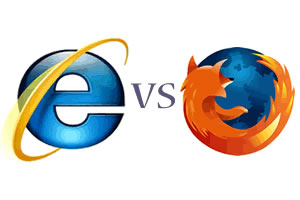

Les Pays-Bas peuvent être considérés comme un pays en avance dans le domaine des nouvelles technologies. Selon Eurostat, c'est le pays d'Europe comptant le plus de foyers connectés. On a aussi vu qu'Amsterdam était le premier point d'échange internet au monde montrant la qualité des infrastructures Internet dans le pays. Il y a pourtant un point sur lequel les Pays-Bas sont à la traine par rapport à ses voisins : L'utilisation de Firefox pour aller sur le web. Pourquoi donc sont-ils les derniers ?

Xitimonitor publie régulièrement son baromettre des navigateurs, histoire de donner une idée de l'évolution des habitudes des internautes. La constante depuis plusieurs années est la progression sûre mais lente de Firefox au détriment d'Internet Exploreur. Il faut dire que Microsoft avait arrêté d'améliorer son logiciel laissant sur le marché un truc buggé alors que le logiciel libre bénéficie d'une grande communauté de contributeurs et de fans.

XitiMonitor nous montre [depuis novembre 2006](http://www.xitimonitor.com/en-us/browsers-barometer/firefox-november-2006/index-1-2-3-68.html) (23.4%) la lente et presque constante progression de l'utilisation de Firefox jusqu'aux dernier chiffres datant de [mars 2008](http://www.xitimonitor.com/fr-fr/barometre-des-navigateurs/firefox-mars-2008/index-1-1-3-127.html) (28.8%). Ces statistiques sont même détaillées par pays et on constate que les Pays-Bas sont toujours dans le peloton de queue (avec l'Ukraine et le Royaume Uni) avec 15% à 16% d'utilisateurs. Souvent ils sont derniers.

On ne peut pourtant pas dire que les néerlandais ne sont pas curieux et interessés par les produits innovants. Ce pays est celui qui compte le plus de foyers dans d'europemais force est de constater qu'une grande majorité de ces foyés n'utilisent que les logiciels fournis par défaut avec un PC-Windows.

{.center}

<!-- Gone {.center} -->

Une autre société, [OneStat](http://www.onestat.com/default-nl.aspx), publie un baromettre des navigateurs en utilisant les données de fréquentation des sites web de ses clients et constate la même progression de l'utilisation de Firefox et le même *mauvais* score réalisé par les Pays-Bas (voir [juillet 2007](http://onestat.com/html/aboutus_pressbox53-firefox-mozilla-browser-market-share.html) et [février 2008](http://www.onestat.com/dutch/dutch_aboutus_pressbox36-mozilla-firefox-internet-explorere-marktaandeel.html)) . Seulement les chiffres sont beaucoup moins importants que ceux publiés par Xiti. OneStat est une société néerlandaise et on finirait par croire que les habitants de ce pays font exprès de mettre en avant les logiciels de Mircrosoft. L'explication vient peut être du fait que beaucoup des sites web audités par OneStat, sont des sites néerlandais, avec une clientèle à majorité néerlandaise et donc équipés de navigateurs Internet Exploreur. Certains sont peut être même conçus pour ce navigateur ce qui empèche les utilisateurs de Firefox de compter parmis les clients. La fameuse histoire de la poule et de l'?uf entre consommateurs et concepteurs des sites web. Cette histoire semble changer puisque les parts de marché augmentent aussi aux Pays-Bas.

L'adoption peu rapide de cette alternative à Internet Exploreur peut avoir deux explications. La première évoquée ci-dessus est la [forte proportion de foyers connectés aux Pays-Bas](/public/images/scans/acces-fixes-par-pays.png). Cela veut dire que la majorité des utilisateurs du web dans ce pays ne sont pas des *early adopteurs*. Une forte proportion d'entre eux se contente de surfer avec les outils qu'on leur fournit sans chercher à tester s'il y a des logiciels plus interessants ailleurs. Une autre explication est peut-être aussi le peut d'engouement des fans de firefox pour promouvoir leur logiciels préféré. Les Hollandais sont par nature moins enclin à partager leurs passions et le bouche à oreille fonctionne moins que dans les pays latins. [Spreadfirefox](http://www.spreadfirefox.com), le site de mondial de promotion de Firefox possède [une section Néerlandaise](http://www.spreadfirefox.com/node/477) mais cette dernière ne semble vraiment pas très active... Que faire?

### Firefox 3 arrive

[{.right}](http://www.spreadfirefox.com/fr/worldrecord)
Mozilla annonce la sortie imminente de la troisième verison de son navigateur Firefox. Plétore de nouveautés et d'améliorations sont au rendez-vous et les fans du monde entier s'organisent pour que cela se sache. Une campagne pour établir un reccord du monde du plus grand nombre de téléchargements en une journée fait rage. Le rendez-vous est pris pour une date (en juin) encore non connue sur le site [Spreadfirefox](http://www.spreadfirefox.com/fr/worldrecord). Chacun sera pressé de télécharger et surtout de tester ce nouveau logiciel qui promet de mieux surfer et d'être plus rapide. La campagne prend bien aux Pays-Bas déjà les plus grands journaux en ont parlé ([De Telegraaf](http://www.telegraaf.nl/digitaal/games/4122603/_Mozilla_aast_op_wereldrecord_downloaden__.html), [Volkskrant](http://www.volkskrant.nl/economie/article542453.ece/Internethulp_met_strenge_portier_en_vergrootglas), [NRC Handelsblad](http://weblogs3.nrc.nl/klaver/2008/05/30/firefox-wil-downloadrecord/)). Peut-être est-ce Firefox 3 saura convaincre les hollandais de laisser tomber Microsoft pour aller sur le web...

* Eurostat: [Utilisation d'internet en Europe en 2007](http://blog.re/me-in-amsterdam/files/data/2007-Internet-Eurostats.pdf) Les Pays-Bas sont en tête.  
* voir aussi: Les Néerlandais sont en tête dans l?Union européenne, s?agissant d?Internet", [relève le Trouw (p.12) (revue de presse de l'Ambassade de France)](http://www.ambafrance.nl/article.php?id_article=9116)
* [Firefox moet in Guinness Book of Records](http://www.planet.nl/planet/show/id=118880/contentid=926358/sc=21ddd8)
* [5 nouveautés et modifications majeures dans Firefox 3](http://www.journaldunet.com/solutions/intranet-extranet/reportage/5-nouveautes-et-modifications-majeures-dans-firefox-3/5-nouveautes-et-modifications-majeures-dans-firefox-3.shtml)

## Et aussi
J'aborde le même sujet dans [Mozilla aux Pays-Bas](/mozilla-aux-pays-bas).
