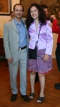

Aujourd'hui, fête nationale, je bosse. Mais ce n'est pas ce qui me chagrine le plus

Ce qui me chagrine le plus c'est que la réception à l'Ambassade de France qui était offerte à tout français dans le monde pour que ce dernier puisse fêter dignement la prise de la bastille est en train de disparaître. Le chef de l'état a décidé de faire des coupes sombres dans le budget de l'état. Bien, dont-acte pourrait-on dire. Apparemment on a jugé bon, au ministère des affaires étrangères d'orienter ces coupes budgétaires vers ce qui touche le commun des français: la réception du 14 juillet ouverte à tous, afin sûrement de préserver les dépenses plus protocolaires réservées à l'élite politico-médiatique et autres porteurs de passe-droits.

Notre représentant à l'assemblée des Français de l'Etranger [a bien écrit au ministre](http://blog.re/me-in-amsterdam/files/data/2008-06-03%20-%20AFE%2014%20JUILLET%20-%20MAE%20MINISTRE_pdf.pdf) responsable de cette décision qui assure dans [sa réponse](http://blog.re/me-in-amsterdam/files/data/2008-06-20%20-%20AFE%2014%20JUILLET%20-%20MAE%20REPONSE%20MINISTRE_pdf.pdf) qu'il n'y est *pas question de ne pas inviter la communauté française* à un pareil évènement mais indique par ailleurs que ce serait impossible de recevoir tout le monde... Jolie pirouette pour justifier la transformation de cette fête populaire en une partie privée sur invitation. Les invitations ont donc été distribuées via les associations plus ou moins représentatives des français de l'étranger ([dont 150 par le lion bleu](http://www.lelionbleu.nl/?p=27)). Et tant pis pour ceux qui étaient en retard. Comme moi, les retardataires ont reçu un mail avec la sécurité pour excuse.

> Suite à votre demande, j'ai le regret de vous faire savoir que, compte tenu du nombre de personnes ayant confirmé leur venue, il ne sera pas possible de vous adresser une invitation pour le 14 juillet.
> Des raisons de sécurité nous obligent en effet à respecter des normes strictes quant au nombre de personnes présentes.
> Merci pour votre compréhension.

{.left}

Fin de non recevoir. Ceci étant d'autant plus difficile à croire que [l'année dernière](/juillet-batave), il était possible de se présenter sans invitation à l'entrée de la résidence et ce, malgré l'affluence. Nous ne pouvons plus fêter le 14 juillet cette année pour des raison budgetaire. On a beau arguer que *Moins de champagne et de petits fours ne nuirait nullement à la convivialité de ces réceptions*, les organisateurs ne peuvent pas prendre le risque de manquer de champagne et de petits fours pour les invités de marque comme beaucoup d'officiels ministres, PDG et militaires Néerlandais. Cette fameuse élite politico-médiatique qui est déjà invitée à d'autres réceptions de travail...

Bref, les réjouissances de la République seront de plus en plus réservées à une élite. On nous explique que c'est pour des raisons budgétaires mais dans le même temps on apprend que le budget de l'Elysée est de plus en plus élevé. On nous explique que l'Elysée s'occupe directement de plus en plus de choses mais évidement pas vraiment en drection des simples citoyens sont invités. La République est tout simplement en train de perdre son esprit républicain. Mais en fait on le savait déjà...
---
<!-- post notes:
http://www.mfe.org/default.aspx?sid=17183
--->
