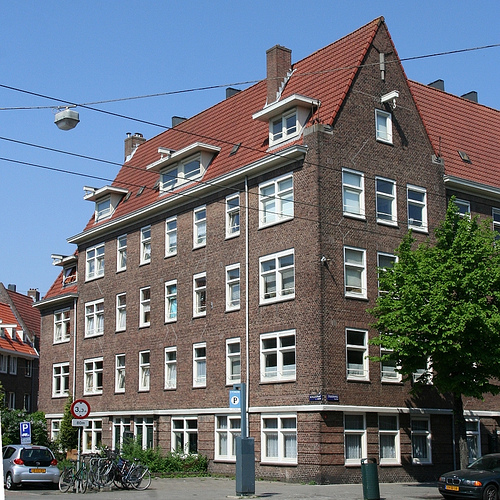

[{.left}](/la-maison-des-annees-20) Après la guerre de 1914-1918, les rescapés de la grande guerre rentrent chez eux, la révolution industrielle poursuit son cours avec un exode rural qui contraint les villes à s'agrandir. Amsterdam se développe. On croit de plus en plus au bienfaits de la modernité pour tout le monde et on construit beaucoup. A Amsterdam, on construit des voies de tramway en comblant des canaux et on construit de nouveaux quartiers à la périphérie du centre-ville. 

L'architecture évolue aussi...

<!--excerpt-->

Alors que les maisons construites au début du siècle (entre 1900 et 1914), comme [la maison rose du pijp](/cest-une-maison-rose), conservaient un certain cachet rappellant les facades hollandaises typiques, les nouvelles maisons des années folles seront radicalement différentes, voulant offrir aux habitants tout ce que le confort moderne propose alors. Toits en tuiles mécaniques, fenètres plus petites et plus faciles à ouvrir, l'eaux à tous les étages et des escaliers plus larges. Dans un même temps ces bâtiments conservent une certaine tradition, [le crochet](/de-haak-crochet) pour monter [les meubles par la fenêtre](/transporter-un-canape), les murs en briques, le toit pointu et les encadrements des fenêtres en bois blancs.

Aux Pays-Bas les maisons construites durant les années 20 l'ont été sur un modèle un peu partout le même dans toutes les villes qui se développaient à cette époque. Elle sont donc caractéristiques du pays et c'est pour ça que je vous en montre une photo aujourd'hui :

[{.center}](http://www.flickr.com/photos/13274211@N00/2649371182/)

Je l'ai trouvée, la fameuse *maison des années 1920* construite au début du siècle dernier. (Ceux qui suivent mes envois de [photos sur flickr](/la-centieme-photo) on déjà vu cette photo).

Ceux qui tenteraient un rapprochement avec [les HBM parisiens](http://www.parisbalades.com/Voc/vocabulaH-M.htm#HBM) ne doivent pas être pris à faux car des ensembles correspondent à peux de chose près à la même approche immobilière dans une même période. Au 19è siècle avec la révolution industrielle, les villes on connu un afflux massif de nouvelles personnes venant de loin pour travailler dans les industries naissantes. Ces derniers se logent tant bien que mal à proximité des usines mais leur logement n'est pas pris en charge et l'insalubrité rêgne. Certains mouvements paternalistes, [hygienistes](http://fr.wikipedia.org/wiki/Mouvement_hygi%C3%A9niste), [chrétiens](http://fr.wikipedia.org/wiki/Catholicisme_social) ou [socialistes](http://fr.wikipedia.org/wiki/Socialisme) font entendre leur voix pour que les ouvriers soient mieux logés et que le logement des plus pauvres soit pris en charge par ceux qui ont les moyens. Les constructions collectives et les aménagements ad hoc ont donc commencés dans les grandes capitales à la fin du 19e siècle emmenés par des corporation et des fondations privées. Après la première guerre mondiale, les gouvernement on commencés à se soucier de logement social et cela a aboutit à la construction des HBM autour de Paris et des *maisons des années 20* autour d'Amsterdam.

<!-- post notes:
http://fr.wikipedia.org/wiki/Cit%C3%A9_ouvri%C3%A8re#Origines_et_sources_d.27inspiration 
http://fr.wikipedia.org/wiki/Habitation_%C3%A0_bon_march%C3%A9
--->
