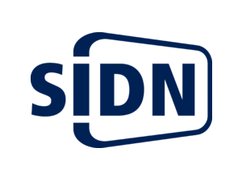
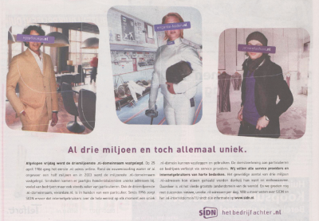

Non je ne vais pas encore parler d'[immobilier](/des-nouvelles-de-l-immobilier) et de domaines fonciers à vendre, il y en a surement plus que ça dans tous les Pays-Bas... Je vais vous parler des **noms de domaine Internet** pour l'extention nationale des Pays-Bas, le **.nl** ; autrement dit les *.nl-domeinnaam*. SIDN est une association en charge des .nl basée à Arnhem en [Gueldre](/les-provinces-des-pays-bas). Cette oragnisation a récement a annoncé avoir enregistré son troismillionième .nl. Seuls 4 pays au monde avait déjà dépassé ce chiffre.

{.left} Dans le petit club des gestionnaires de domaines Internet, les Pays-Bas sont bien placés, actuellement en 8ème position selon [domainesinfo.fr](http://www.domainesinfo.fr/actualite/441/statistiques-mondiales-des-noms-de-domaine.php), derrière le .com, le .de allemand ou le .cn chinois. Cette position est d'autant plus méritoire que l'accès au .nl est limité aux habitants de ce petit pays de presque 17 millions d'habitants. A ma connaissance, le **.nl** est l'extention nationnale avec la meilleure pénétration avec quelques 18 noms de domaine pour 100 habitants. Depuis longtemps les .nl étaient accessibles aux entreprises comme aux particuliers sans qu'un *droit au nom* soit demandé. Ceci explique cette forte adhésion au .nl alors que le .com semble réèlement avoir moins de succès ici qu'en France par exemple. Une autre explication est le fait que les Pays-Bas sont un des pays [les mieux connectés d'Europe](/public/images/scans/acces-fixes-par-pays.png), ceci motivant la demande et la création de contenus auquels il est aisé de donner une adresse se terminant par .nl.

Les autres extentions populaires aux Pays-Bas (en plus du **.com** qui est populaire dans le monde entier) sont le **.nu** et le **.eu**. **nu** est le code pour les noms de domaines de l'état insulaire de [Niué](http://fr.wikipedia.org/wiki/Niue) et comme ce mot *nu* a diverses significations intéressantes dans le monde, les autorités de ce petit état ont donc décidé de commercialiser leurs noms de domaine dans le monde entier par l'intermédière d'une fondation basée aux Etats-Unis qui aide au développement de l'Internet à Niué. Dans la langue de Willem Godschalk van Foquenbroch, *nu* signifie **maintenant**, les néerandais surfent donc souvent sur des sites qui se veulent actuels et l'[affichent dans leur domaine](http://nic.nu/tour/tour_images.cfm?ID=EN&site=1942&page=1). Le .eu, quand à lui, ouvert à tous les européens a séduit beaucoup d'entreprises hollandaises dès son lancement. Les Néerlandais sont les [deuxièmes plus gros détenteurs de .eu](http://www.eurid.eu/en/about/facts-figures/statistics), juste derrière le pays le plus peuplé d'Europe.

Mais revenons au .nl qui nous intéresse aujourd'hui. SIDN a largement communiqué sur son [trois-millionième nom de domaine](http://www.sidn.nl/ace.php/c,727,5913,,,,SIDN_registreert_3_000_000ste_nl-domeinnaam_updated_.html), *vivianlam.nl*, déposé par une certaine Vivian Lam résidant à Amsterdam. En ce moment, la croissance du .nl est d'ailleurs boustée par les particuliers selon les dires de l'organisation. En fin de communiqué; SIDN donne quelques chiffres du marché des noms de domaine en terre batave: 
* La longueur moyenne des noms de domaines en .nl est de 16 caractères contre 13 pour le reste des TLD
* La ville qui habrite le plus grand nombre de titulaires de noms de domaine est Amsterdam mais on remarque aussi la bonne position des villes universitaires comme Groningue, Enschede, Nimègue et Eindhoven.
* 66% des titulaires on pris un nom de domaine pour personnaliser leur adresse email
* Le tout premier nom de domaine fut cwi.nl, enregistré le 1er mai 1986. Ce nom est encore untilisé aujourd'hui
* Il y a environ 1700 noms de domaine enregistré quotidiennement
* Le nom de domaine en .nl le plus cher est *voetbal.nl* (football) vendu en l'an 2000 pour un million de florins
* Le prix moyen des noms de domaine en .nl vendus aux enchères a augmenté de 50% depuis l'année dernière de ± 1.000 et ± 1.500
* Le marché des noms de domaine aux Pays-Bas est répartit comme suit: .nl 70%, .com 14% en .eu 9%
* La proportion de particuliers titulaires de .nl est passée de 29% le 1er janvier 2007 à 33% le 1er janvier 2008.

## Les moins bonnes nouvelles

SIDN n'a pas toujours des annonces plaisantes à faire. On peut souligner le ratage à l'occasion de l'ouverture des noms de domaine numériques dont la sunrise a eu lieu en décembre 2007 et la véritable ouverture prévue [fin février 2008](http://www.sidn.nl/ace.php/c,727,5497,,,,Vanaf_28_februari_registratie_zuiver_numerieke_nl-domeinnamen.html). Les serveurs de SIDN n'ayant pas su faire face à [la forte demande](http://www.sidn.nl/ace.php/c,727,5567,,,,05-03-08_Update_2_Landrush_Numerieke_Domeinnamen.html) et certains noms demandés plusieurs fois n'ont pas pu être attribués. C'est finalement [par tirage au sort](http://www.sidn.nl/ace.php/c,727,5601,,,,Heruitgifte_numerieke_domeinnamen.html) qu'ils on été attribués. Au mois de mai, [un problème de serveur en pleine nuit](http://www.sidn.nl/ace.php/c,728,5655,,,,Service_interruption_update_12_20_hrs_CET_.html) a commencé à rendre injoignable certains sites web en .nl. La panne a été corrigée après 6 heures du matin mais celà est suffisant pour que les politiques veuillent [s'assurer de la continuité du service](http://www.domainesinfo.fr/extension/1535/hollande-le-ministere-de-l-economie-hollandais-veut-renforcer-la-securite-du-nl.php).

Enfin, en juin dernier, un registrar europeen, titulaire du **.co.nl** a [annoncé](http://www.domainnews.com/en/general/co.nl-opens-a-new-horizon-for-the-dutch-internet.html) la commercialisation de sous domaines en .co.nl. La commercialisation de sous-domaines n'est pas interdite mais l'annonce du service en plein [ICANN meeting](http://par.icann.org/) prête à confusion et semble présenter l'offre comme une possibilité officielle pour non résident des Pays-Bas d'obtenir un .nl. domain.co.nl joue sur la confusion qu'il existe parce que certaines extentions nationales proposent d'être titulaire d'un .co.XX géré par le registre du pays. Ce n'est pas le cas pour le .nl et SIDN a jugé utile de le rappeller dans un récent communiqué en anglais. *[Anyone who registers a co.nl label is NOT registering a .nl domain name](http://www.sidn.nl/ace.php/c,728,5881,,,,Information_about_co_nl.html)*.

L'année 2008 est mouvementée pour SIDN mais malgré toutes ces histoires, on en arrive à célébrer 3 milions de noms de domaine qui sont un des signe de la bonne pénétration de l'Internet aux Pays-Bas. L'association de Arhhem en profite pour faire de la pub dans les journaux, tentant de convaincre les PME et les particuliers qui ne l'ont pas fait de prendre eux aussi leur nom de domaine en .nl.

{.center}

Le nombre de noms de domaine en .nl devraient donc continuer à augmenter. J'y apporte d'ailleurs ma contribution puisque je suis maintenant titulaire de `meinamsterdam.nl` que je compte utiliser un jour pour ce blog.

<!-- post notes:
http://www.sidn.nl/ace.php/c,728,5655,,,,Service_interruption_update_12_20_hrs_CET_.html 
http://www.sidn.nl/ace.php/c,727,5601,,,,Heruitgifte_numerieke_domeinnamen.html 
http://www.domainesinfo.fr/actualite/441/statistiques-mondiales-des-noms-de-domaine.php 
http://www.domainnews.com/en/general/co.nl-opens-a-new-horizon-for-the-dutch-internet.html 

http://www.domain.co.nl/ 
http://www.webhosting.info/domains/
--->
