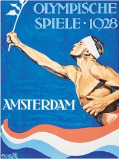

{.left}
Je ne pouvais passer à coté du sujet en cette année olympique. Il y a 80 ans, les jeux olympiques étaient organisés à Amsterdam. Il furent un succès et marquèrent Amsterdam tout comme l'olympisme. Comme [nous le raconte](http://www.olympic.org/fr/games/past/index_fr.asp?OLGT=1&OLGY=1928) le site du **Comité Olympique International**, c'est en 1928 que **le symbole de la flamme olympique** fut allumé pour la premiere fois. La vasque contenant la flamme trône encore aujourd'hui en haut d'une tour de 42 m de haut, à l'entrée d'un stade olympique flambant où se déroule encore des compétitions sportives. C'est aussi à Amsterdam, en 1928 que les premières compétitions féminines eurent lieu.

Le [stade olympique d'Amsterdam](http://fr.wikipedia.org/wiki/Stade_Olympique_(Amsterdam)) a été construit dans un quartier neuf de la ville dans un style art-déco de l'époque incluant beaucoup de nouveautés pratiques comme un panneau d'affichage géant, visible par tous les spéctateurs. Il est l'oeuvre de l'architècte Jan Wils, l'un des architectes de l'''école d'Amsterdam* et co-fondateur du mouvement *De Stijl''. Le quartier Olympique reste aujourd'hui un exemple de l'architecture de cette époque avec ses [maisons des annés 20](/la-maison-des-annees-20) et ses noms de rue évocateurs (Stadionweg, Minervalaan, Olympiaplein, Herculesstraat, Marathonweg...).  

Plusieurs fois transformé pour acceuillir plus de monde ou de nouvelles compétitions, le stade Olympique d'Amsterdam a été remis à neuf en 2000 après avoir été fortement endomagé par une tempète en 1999. Il a retrouvé aujourd'hui son aspect original mais avec des aménagements intérieurs modernes (restaurant, buraux et [le parking P+R le plus proche du centre](/pour-ceux-qui-viennent-nous-voir-en-voiture)). Avec tout cela, il acceuille toujours des [compétitions sportives](http://olympischstadion.nl/index.php?option=com_content&task=view&id=39&Itemid=129).

<!-- HTML -->
<table align="center" border="0"><tr><td>
<!-- / HTML -->
[{.center}](http://www.flickr.com/photos/13274211@N00/2658745992/)
<!-- HTML -->
</td><td>
<!-- / HTML -->
[{.center}](http://www.flickr.com/photos/13274211@N00/2658746090/)
<!-- HTML -->
</td></tr></table>
<!-- / HTML -->
---
<!-- post notes:
http://www.sportgeschiedenis.nl/2008/07/12/de-rode-duivel-van-de-marathontoren.aspx
--->
