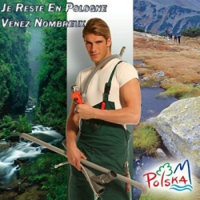
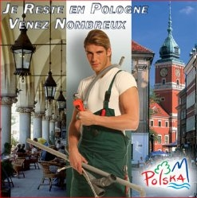
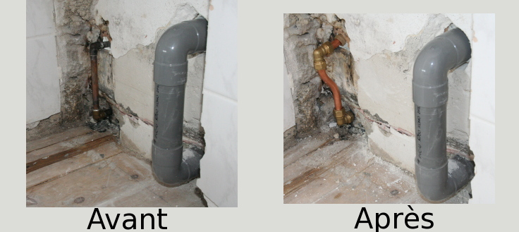

Voilà maintenant un mois que je suis dans [mon nouveau logis](/signatures-week) mais comme j'ai décidé d'y faire des travaux, voilà un mois que je fais du camping dans le salon. Dernière aventure en date, le déplacement de la machine à laver avec déviation de tuyaux cuivres et PVC. Hélas, je suis bien mal préparé pour les travaux de plomberie. J'ai commencé par couper un tuyau un soir alors que je n'avais pas tout le matériel. **Ceci nous a privé d'eau pendant une journée.** Une fois que j'avais tout ce qu'il faut, j'ai put mettre en place les tuyaux et tout souder mais encore hélas, mon installation présentait des fuites. J'ai repris plusieurs fois cette canalisation avant de me résigner à une autre solution.

Un collègue polonais m'a donné le numéro d'un plombier, polonais lui aussi. Il a ajouté que je pouvais l’appeler si je n'étais pas trop fier d'être français. Ceci nous a ramené trois ans plus tôt en plein [référendum pour une constitution européenne](https://fr.wikipedia.org/wiki/Trait%C3%A9_de_Rome_%282004%29) (sic), période pendant laquelle le plombier polonais n'avais pas trop la cote en France. 

## Le plombier polonais de 2004
À l'origine de cette querelle il y a un hollandais ce qui me permet de rester dans le thème de ce blog. **Frits Bolkestein**, pour le citer, est  un ancien dirigeant du [VVD](http://fr.wikipedia.org/wiki/Parti_populaire_lib%C3%A9ral_et_d%C3%A9mocrate_(Pays-Bas)), parti populaire, un chouilla xénophobe et surtout libéral des Pays-Bas. Ancien commissaire Européen, il est à l'origine de *la directive services*, souvent appelée *directive Bolkenstein* pour la libéralisation des services en Europe. Alors qu'il n'était plus commissaire Européen, **Frits Bolkestein est entré dans le débat français sur le référendum européen pour défendre sa directive très décriée par les partisans du non**.

Il a cru bon a un moment de parler de sa résidence secondaire en France et de sa difficulté supposée de trouver un bon plombier. Grâce à cette directive, ajouta-t-il, il serait très content de trouver un bon plombier polonais. Cela lui a valu de se faire couper le gaz par des cégétistes du nord et a permis au [plombier polonais](http://fr.wikipedia.org/wiki/Plombier_polonais) de se hisser au rang de symbole du dumping social. L'affaire a eu des répercutions en Pologne ou les frères Lech et Jarosław Kaczyński en on profiter pour défendre les plombiers de leur pays dans le bel élan populiste qu'on leur connait. 

L'office du tourisme de Pologne a aussi repris avec humour l'image du plombier polonais pour promouvoir le pays[^1]...
<!-- HTML -->
<table align="center" border="0"><tr<td>
<!-- / HTML -->
{.center}
<!-- HTML -->
</td><td>
<!-- / HTML -->
{.center}
<!-- HTML -->
</td></tr></table>
<!-- / HTML -->

## Le plombier polonais de 2008

**Amsterdam est une ville ou la présence d'ouvriers polonais dans la construction est très visible**. Peut-être pas au point de rivaliser avec Londres ou Chicago mais le faible taux de chômage fait d'Amsterdam une destination de choix pour les polonais cherchant un travail à l'étranger, et la petite taille (relative) de la ville rend leur présence visible. J'avais moi aussi besoin d'un plombier et c'est tout naturellement que j'ai appelé ce gars. 

En fait de disponibilité, ce plombier était comme les autres, qualifiant ma fuite de non urgente, il ne pouvait venir que la semaine suivante. Il a heureusement tenu sa promesse et fait du bon travail. Et moi, j'ai ravalé ma fierté.

{.center}
---
[^1]: Bon sur les affiches c'est un mannequin habillé en plombier mais vous avez compris le message.