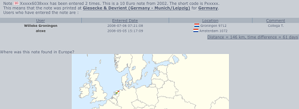

## ( Pays-Bas → Pays-Bas )
**Les Pays-Bas et la France sont dans la zone euro depuis 1999** ce qui fait que dans ces deux pays, j'utilise le même porte-monnaie, que je ne souffre pas de frais de change que je peux comparer les prix d'un pays à l'autre etc. Depuis six ans (2002) qu'on utilise une monnaie unique, les milliers d'expats qui, comme moi, rentrent au pays de temps en temps; les millions de touristes, profitent de ces avantages et font voyager les pièces et les billets dans l'euroland et même ailleurs dans le monde.

**Il est possible de suivre ses billets à la trace**, de les regarder voyager dans le monde. C'est ce que j'essaye de faire depuis mars dernier sur le site [Eurobilltracker](http://www.eurobilltracker.eu/?referer=31378). On y découvre plein de choses intéressantes.

**Chaque billet d'euro est unique**, il possède un numéro de série et un code que l'imprimerie cache dans le dessin du billet. Le numéro de série commence par une lettre correspondant au pays d'émission du billet. Aussi la première lettre du code imprimeur indique où ce bout de bifton a été imprimé. Les chiffres correspondant à la valeur, je pense que tout le monde maîtrise je ne vais donc pas m'attarder là dessus[^1]. Voilà, rien qu'en regardant un billet de banque en Euro, on peut en connaître beaucoup sur son passé mais à moins qu'un de ses précédant propriétaire ne l'ait signé, il est impossible de savoir dans quelles mains le flouze a circulé et surtout dans quels pays.

On est donc invités à enregistrer les détails de chaque billet d'euro passant par nos portefeuilles sur le site [EuroBillTracker](http://www.eurobilltracker.eu/?referer=31378) (EBT pour les intimes). Ce dernier enregistre tous les billets qui lui sont soumis. S'il arrive que ce dernier soit déjà enregistré par quelqu'un d'autre, on peut voir d'où il vient. Si plus tard, quelqu'un enregistre à nouveau ce même billet, on pourra voir où il est passé. Les habitués appellent ça un *hit*. La masse monétaire de la vieille Europe est si grande qu'il semble quasiment impossible de retrouver quelqu'un retrouvant un jour un billet qu'on a déjà utilisé. Mais par son ancienneté et sa fréquentation, le site en référence déjà plusieurs centaines de milliers. 

> Plus les membres enregistrent de billets, plus les chances de faire des hits sont grandes.

Je me suis donc inscrit sur ce site au mois de février, enregistrant patiemment tous les billets en euros qui me filaient trop vite entre les doigts. [Mon premier hit](http://fr.eurobilltracker.eu/notes/?id=46050399&referer=31378) a eu lieu le six juillet alors que j'essayais péniblement de terminer de déménager les derniers cartons. Mon partenaire de hit se fait appeller *Willeke Groningen* et habite Groningue ([au nord du pays](/les-provinces-des-pays-bas)), ce qui fait que mon billet de 10 a déjà parcouru 61 km.

[{.center}](http://en.eurobilltracker.eu/notes/?id=46050399&referer=31378)

Willeke a déjà enregistré plus de 3000 billets soit dix fois plus que moi. Mais ce n'est pas le champion. dans cette dicipline là aussi ce sont les néerlandais se font remarquer, deux d'entre eux sont dans le top 5 et [les Pays-Bas sont troisième](http://fr.eurobilltracker.eu/rankings/?command=262144&tab=11&c=0&nocookie=1&timestats=7&referer=31378) en nombre de billets entés depuis l'ouverture du site. Ils sont précédés de l'Allemagne, qui justifie sa place de sa forte population, suive par la Finlande qui est le pays qui compte le plus d'utilisateurs du site. C'est d'ailleurs dans ce pays qu'est hébergé EuroBillTracker. La France ? elle est dans les choux, elle devrait se faire doubler bientôt par la Slovénie qui n'utilise officiellement l'euro que depuis 2007.

Qu'attendez-vous donc gens de France, [inscrivez-vous sur EuroBillTracker](http://fr.eurobilltracker.eu/signup/?referer=31378) et montrez qu'en France aussi les billets voyagent.

--- 

Ce n'est pas fini, voyez mon nouveau [record de hits](/euros-records-de-hits).

---
[^1]: Pour en savoir plus lisez cet [article sur les billets de banque en euros](http://fr.wikipedia.org/wiki/Billets_de_banque_en_euro)