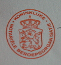

[{.center}](/signatures-week)

La première semaine de juillet a été tres mouvementée et c'est surement pour ça que je n'ai rien posté pendant cette période. J'ai passé la semaine à préparer, relire, essayer de comprendre et finalement à signer des documents important pour ma vie. Important pour ma vie, c'est autre chose que tous [ces papiers administratifs](/mes-premiers-pas-comme-immigre) et autres [cartes inutiles](/carte-inutile) qu'on nous fait faire régulièrement.

## Leveringsakte
Acte définitif d'achat d'un bien immobilier. Ça y est, nous sommes propriétaires au Pays-Bas depuis le premier juillet, un bel appart. dans le joli quartier du *Pijp*. Tout pour plaire. Ce contrat de vente n'est pas très différent de ce que l'on peut signer en France. Ah si, la visite du bien juste avant le rendez-vous chez le notaire m'est apparue très courtoise mais il semblerait que ce soit plutôt une obligation. La remise des clefs n'est pas conditionnée à la remise du chèque puisque tout ici se passe par virement et que le notaire est en contact direct avec la banque. Nous n'avons plus à nous occuper de quoi que ce soit. juste signer. là, en bas...

{.center}

## Hypotheek
Nous avons pris un [crédit à terme](/credits-pays-bas) et la banque a donc hypotèqué notre nouvel appart. Il faut donc signer cette hypotèque devant notaire pour la bonne forme. À noter qu'une interprète français/néerlandais nous as honoré de sa présence pour traduire les termes juridiques bataves dans la langue de Me Gilbert Collard ce qui nous a autant éclairé qu'une lampe de poche sans pile. Les explications du notaire en anglais nous ont été beaucoup plus utiles. Mais tout le monde le sait, le notaire n'emploi de jargon que pour sembler sympa en l'expliquant. C'est d'ailleurs à ça qu'on les paye non ?

## Samenlevingscontract
Ce contrat là n'est pas une nécécité quand on prend un crédit ni même un bien en commun. Mais on conseille parfois ce *contrat de vie en ensemble*. C'est une sorte de PACS que tous concubains peuvent demander à signer auprès de leur notaire. C'est ce que nous avons fait le même jour que la signature d'achat de l'appart. moyennant un petit extra pour le notaire qui en profite toujours pour utiliser son jargon.

{.center}

## Contrat de travail
Voila un an aujourd'hui que je suis dans [mon nouveau boulot](/nouveau-mois-nouvelle-boite), avec un contrat à durée déterminée de un an. Comme ça se passe bien, mon employeur m'a proposé un CDI. Me voilà donc à bosser pour RIPE NCC pour une durée indéterminée. J'ai signé ce nouveau contrat début juillet sans avoir besoin des explications d'un notaire pour comprendre.

{.center}
