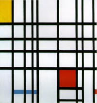
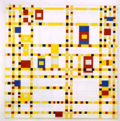
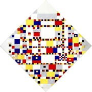

Je ne vous ai pas encore parlé de **Piet Mondrian** (Pieter Cornelis Mondriaan), le grand peintre Néerlandais du XXe siècle. Mais je vais aujourd'hui combler ce manque, rattrapé par l'actualité. [Piet Mondrian](http://fr.wikipedia.org/wiki/Piet_Mondrian) est sans doute le peintre Néerlandais le plus connu du XXe siècle. Il s'est mis très tôt à l'art abstrait et, grand contributeur de la revue de stijl il fait connaître le mouvement cubiste avant de se forger un style propre, plus rigoureux, à base de lignes noires perpendiculaires et de couleurs primaires.

{.center}

Piet Mondrian s'est installé à Paris en 1919, puis craignant la progression du nasisme, il déménage en 1938 à Londres puis à New York ou il meurt en 1944. Ses derniers tableaux abandonnent les lignes noires et adoptent des rectangles plus petits et plus colorés. 

{.center}

Les noms de *Broadway Boogie Woogie*, *[Victory Boogie Woogie](/voctorie-boogie-woogie-decortique)* ou même *New York City* indique clairement la source d'inspiration musicale de ces toiles New-yorkaises. C'est sans doute sa dernière toile, **Victory Boogie Woogie** qui fait l'actualité aujourd'hui.

La toile **Victory Boogie Woogie** a été achetée en 1998 par le **musée municipal de La Haye** pour la modique somme de 80 millions de florins. Cette toile est particulière parce que certaines zones sont colorés par des assemblages de ruban adhésifs comme le montre [une photo du NRC](http://www.nrc.nl/kunst/article1965147.ece/De_waarheid_van_Mondriaans_Victory). Pendant deux ans, les experts du musée ont [observé](http://www.parool.nl/parool/nl/22/Kunst/article/detail/29479/2008/08/28/Mondriaan-was-boogie-woogie.dhtml), scanné, et passé la toile sous plusieurs sortes de rayons X, ultra-violets etc. Le résultat de ces deux années de travaux est présenté depuis le 28 août dans le musée de la capitale de Hollande du Sud et ils sont trés interessants. Il semblerait que la toile est d'abord été peinte par l'artiste avec ses trois couleurs primaires habituelles. Certaines zones ont ensuite été repiquées en peinture ou avec des collages de rubans adhesifs. C'est avec ces collages que de nouvelles couleurs comme le bleu marine ou le rouge vif sont apparus sur le tableau tel qu'on le connaît. Les experts ont même produit à l'aide d'ordinateurs, un toile montrant le tableau avant cette dernière transformation par l'artiste.

[{.center}](http://www.gemeentemuseum.nl/index.php?id=031845)

C'est très interessant a voir mais hélas je n'arrive pas a trouver de reproduction de cette pré-toile alors pour ne pas rester quoi devant cette toile de 35 millions d'euros, je vous propose [un sujet de la NOS](http://www.nos.nl/nosjournaal/artikelen/2008/8/28/280808_boogie_woogie.html) qui vous explique tout ça.

Voir aussi [la page Mondrian](http://www.gemeentemuseum.nl/index.php?id=031845) sur le site du musée municipal de La Haye (Gemeente museum Den Haag) avec quelques vu rapprochées de ce tableau.
---