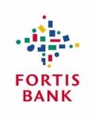

Vous avez suivit mes aventures aux Pays-Bas, mon nouveau boulot et ma [nouvelle maison](/signatures-week). Dans toutes ces étapes importantes de la vie, il y a des banques qui me soutiennent et des assurances qui me protègent. Au boulot, mes cotisations retraite vont sur un fond de pension et mes cotisations maladies sont versées à une assurance. Pour l'achat de ma maison, j'ai signé un prêt à terme et une assurance vie auprès de deux établissements différents. Par les temps qui courent, c'est bien de ne pas mettre ses oeufs dans le même panier. Sauf qu'en l'occurrence, tous ces produits sont gérés par des établissements d'un même groupe, un groupe bancaire **Fortis**, dont la santé actuelle n'est pas euphorique. Petit récapitulatif.

----
  
Aussi bien à mon [premier boulot](/de-mon-boulot) qu'à [mon nouveau](/mon-nouveau-boulot-3), mon employeur m'offrait une assurance maladie. La sécurité sociale ayant été privatisée en 2005, les cotisations sont versées à une assurance pivée choisie par l'employeur. Le salarié peut choisir différents forfaits en fonction de son état de santé et de son revenu. Mes deux employeurs m'on proposé des contrats interessants avec **Amersfoortse**. Cette compagnie offre apparement les paquages les plus intéressants. Il faut dire que comme l'assurance maladie vient d'être privatisée, il est important de bien se possitionner pour attirer le plus grand nombre de clients quitte a perdre des sous par la suite... Amersfoortse est une société du groupe Fortis, c'est écrit sur les courriers de décomptes que je reçois.

----
  
Le vous ai parlé des [crédits immobiliers aux Pays-Bas](/credits-pays-bas). Je vous ai expliqué que j'ai choisit un crédit à terme qui m'endette jusqu'après ma mort et vous vous doutez que c'est chez **Fortis** que je suis allé. Ces derniers offrait le meilleur taux et de bonnes conditions. Avec ce prêt, la banque nous a ouvert un compte joint pour y prélever les échéances. Nous voilà avec **un compte Fortis** avec une **carte Fortis** et des échéances 
Fortis à régler tous les mois. On peut gérer tout ça en ligne sur le site [fortisbank.nl](https://www.fortisbank.nl/bankzaken/home/startSiteAction.do).

----
  
Avec mon prêt immobilier, j'ai pris une **assurance vie**. L'assurance vie est une forme d'épargne dont le capital est garanti même en cas de décès de l'épagnant. La cas du décès de la compagnie d'assurance n'est pas envisagé. La compagnie qui assure la gestion de cette assurance vie s'appelle **Interloyd Levens**. On peut voir sur [leur site web](http://www.interlloyd.nl/default1.asp?w=1600&content=) que c'est une compagnie du groupe Fortis.

----
  
Quand ma fiancée fait les courses, elle le fait à partir de son compte **ABN AMRO**. Ce fleuron bancaire des Pays-Bas (avec un joli [siège social à Amsterdam](/abn-amro-banque)) a été [racheté et dépecée](/les-petites-courses-de-l-ete) violemment l'année dernière. À l'époque encore, les banques se la pètait grave. Les opérations Néerlandaises d'ABN AMRO ont été reprises par Fortis, groupe belgo-néerlandais qui dispose déjà d'un réseau d'agences aux Pays-Bas mais a promis de ne pas (trop) virer de gens... Tous les mois ma fiancée rembourse un prêt immobilier Fortis depuis son compte ABN AMRO. C'est pratique, si l'une des deux banques fait faillite, nul besoin de prévenir l'autre, elle fait faillite aussi.

----
  
Enfin, dans ma boite, nous bénéficions d'**un plan épargne retraite**. Je ne sais pas si c'est obligatoire mais il me semble que toutes les boites que je connais offrent des plans épargne retraite à leur salariés. Il faut dire que la retraite de base (AOW pour *Algemene Ouderdomswet*) à laquelle tout le monde peut prétendre, n'est pas très élevé et toute personne de mon âge a intérêt à avoir une épargne pour ses vieux jours. Les plans épargne retraite sont fait pour ça. Ma boite a donc engagé [des consultants](http://www.hetpensioenbureau.nl/_/WIE_ZIJN_WE.html) (*Het pensioen bureau*) pour proposer à chaque salarié un plan personnalisé. Je cotise maintenant régulièrement auprès d'une société qui s'appelle **FORTIS ASR** ce qui me garantie a terme un capital qui m'assurera [une pension décente](http://www.fortisasr.nl/Fondsen_en_koersen/Fortis_ASR_fondsen_Pensioen/Fortis_ASR_Mixfonds_Pensioen_1.cmt).

----
  
Dans un mois je vais faire un voyage dans un pays exotique et pour éviter que ceci tourne au cauchemar, je préfère prendre une **assistance rapatriment** qu'on appelle ici assurance de voyage (*Reisverzekering*). Je compte prendre cette assurance chez **Europeesche**, une compagnie avec des contrats simples et clairs qui m'aidera a être me sentir protégé quand je voyage. En plus, ce n'est pas dit [sur leur site](http://www.europeesche.nl/verzekeringen/reizen/doorlopendereisverzekering/), mais ils bénéficient de l'expérience et de la solidité d'un grand groupe: **Fortis**. Ce ne peut que me rassurer.

----
Comme je le disais au début, en confiant toutes ces choses importantes de ma vie au même groupe, j'ai un peu l'impression, comme dans la chanson d'Eddy Mitchell, d'appartenir à la société anonyme. Heureusement pour moi, cette société vaut un peu plus que ça et même que [selon l'usine nouvelle](http://www.usinenouvelle.com/article/resultats-meilleurs-que-prevu-pour-fortis-au-2e-trimestre.144153), elle se porte très bien. [Le soir de Bruxelles rappellait](http://www.lesoir.be/actualite/economie/fortis-perd-20-a-la-bourse-d-2008-09-16-639153.shtml) même que beaucoup de gens propagent de fausses rumeurs à propos de ce fleuron européen de la finance.

Depuis, [Fortis a été nationalisée](/les-deboires-de-la-royal-bank-of-scotland) lors de la crise de 2008 et est redevenue ABN AMRO. J'appartiens maintenant à la société d'état mais anonyme...

<!-- post notes:
http://www.usinenouvelle.com/article/resultats-meilleurs-que-prevu-pour-fortis-au-2e-trimestre.144153 
http://www.lesoir.be/actualite/economie/fortis-perd-20-a-la-bourse-d-2008-09-16-639153.shtml 
----
http://www.fortismarathonrotterdam.nl/ 
http://www.feyenoord.nl/pages/datapresenter/s2/matchinfo.aspx?dataid=10010000032370 
http://www.interlloyd.nl/default1.asp?w=1600&content= 
https://www.amersfoortse.nl/appl/da/internet/intnav.nsf/iFramesInt?openform
https://www.amersfoortse.nl/appl/da/internet/intnav.nsf/iFramesInt?openform 
http://www.fortis.nl/ 
https://www.fortisbank.nl/bankzaken/home/startSiteAction.do 
https://www.bpo.be/portal/start_BE_P.asp 
http://www.europeesche.nl/verzekeringen/reizen/doorlopendereisverzekering/
--->
