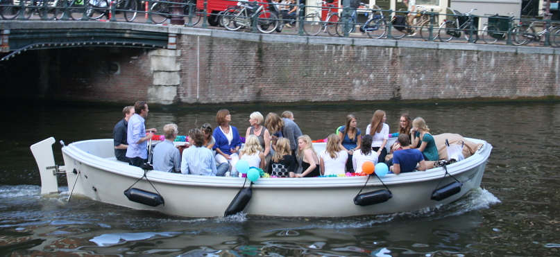

C'est la rentrée # Pour ceux qui ne le savent pas encore, il y a quelques signes qui ne trompent pas. C'est à Amsterdam et nulle part ailleurs...

La semaine dernière, j'ai remarqué des jeunes gens habillés bizarre qui déambulaient dans les rues. Certains garçons avaient les cheveux anormalement blonds et de la farine sur le T-shirt. Des filles en short collants et guêtres colorés transportaient des oeufs. D'autres joyeux drilles ne ressemblaient pas vraiment à des touristes. Ce n'est qu'au bout de quelques jours que j'ai compris que c'était l'intégration des **nouveaux étudiants qui viennent s'installer à Amsterdam** pour commencer leurs études supérieures dans une des universités de la ville.

Dimanche le soleil était au rendez-vous et beaucoup de ces jeunes ont loué des bateaux ou des grosses barges pour se promener sur les canaux avec bière et musique. Ces groupes n'étaient pas que des groupes d'étudiants parce qu'en ce début septembre, il y a aussi la rentrée des clubs sportifs. Les équipes de hockey (sport très populaire ici bas) organisent des parties, des retrouvailles avant de recommencer l'entraînement et les matchs. Il parait que c'est très important pour l'esprit d'équipe.

{.center}

Dimanche aussi, la ville était pleine de camions de location pour assurer des déménagements. Nous étions le 31 du mois et beaucoup de gens déménagent le dernier/premier jour du mois pour profiter au maximum de leur dernier loyer mensuel. Beaucoup utilisaient le [crochet traditionnel](/de-haak-crochet) en haut des maisons. Ce n'est que lundi que j'ai vu des déménageurs professionnels emménager en centre-ville avec des [plate-formes élévatrices](/les-demenageurs-futes). Le rapport avec la rentrée ? Il me semble qu'il y avait plus de déménagement qu'à l'accoutumé. Sûrement les nouveaux étudiants.
