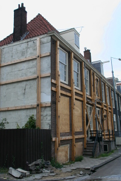
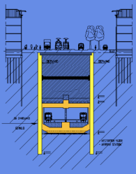

{.left}

Les travaux de [la ligne du nord au sud](/la-ligne-du-nord-au-sud) (*Noord Zuidlijn*) n'ont pas fini de faire parler d'eux. Il y a trois mois les travaux sous la rue Vijzelgracht ont été interrompus après la découverte de fissures sur une maison de la rue qui s'enfonçait. Pendant plusieurs jours la rue était fermée au trafic (même pour les vélos). Depuis la maison a été consolidée avec une drôle de charpente extérieure en bois.

Les [maisons d'Amsterdam](http://blog.re/me-in-amsterdam/?q=maison) sont très fragiles, leurs fondations sont formées de pieux en bois qui reposent sur une couche de sable. L'ensemble tient parce que les maisons sont légères et le sable repose sur d'autres couches plus stables et maintenues par l'humidité des sols. Les maisons anciennes d'Amsterdam s'enfoncent malgré tout et sur certaines, il faut parfois reprendre le sous-oeuvre pour les restabiliser. l'ensemble des maisons du centre ville est surveillé en permanence par un système automatique qui permet de détecter tout affaissement anormal.

Quand la construction de la ligne du nord au sud a été annoncée, les habitants avaient beaucoup de craintes pour les nuisances en ville ainsi que pour la stabilité des vieilles maisons historiques du centre ville. L'entreprise qui a pris le projet en main, a expliqué que les nuisances seraient limités parce que l'essentiel des travaux seraient souterrains et que les maisons devraient être épargnées parce que les tunnels seraient creusés dans une couche de sable en dessous de celle sur laquelle reposent les maisons. Biensur, un gros projet comme celui ci ne se passe jamais comme prévu. L'ouverture de la ligne prévue en 2007 est ajoujourd'hui annoncée pour 2011 et le budget a plus que triplé.

{.right}

Cette semaine l'incident a été spectaculaire. Tous près de la maison consolidée, quatre bâtiments se sont affaissés, parmi eux, la Maison Descartes[^1], institut culturel français. trois autres bâtiment sont des maisons de particuliers dont **une s'est affaissée de 23 cm**. L'évènement est tellement impressionnant qu'elle fait la une des journaux, les familles sinistrées passent à la télé[^2] et les politiques font de grandes déclarations à propos de ce chantier. Certains journalistes demandent si le projet ne sera pas tout bonnement arrêté. Comme toujours il est trop tôt pour savoir ce qu'il va se passer mais en tout cas, on n'a pas fini d'entendre parler de la *Noord-Zuidlijn*.

---
[^1]: [Maison Descartes blijft open ](http://www.parool.nl/parool/nl/124/VERKEER/article/detail/32175/2008/09/13/Maison-Descartes-blijft-open.dhtml)
[^2]: [Drama metrolijn zet zich voort](http://www.ad.nl/amsterdam/2605164/Drama_metrolijn_zet_zich_voort.html) - [11 september 2008: Extra nieuwsuitzending verzakking Vijzelgracht](http://web.at5.nl/wp-content/plugins/embedthevideo/popup.php?url=mms://media.at5.nl/achtergrond/080911_NieuwsExtra.wmv&height=225&width=400)
<!-- post notes:
http://www.rtvnh.nl/nieuws/index.asp?newsid=89965&tijdlijn=1
http://www.parool.nl/parool/nl/124/VERKEER/article/detail/32099/2008/09/13/NZ-debacle-wie-wil-terug.dhtml 
http://web.at5.nl/wp-content/plugins/embedthevideo/popup.php?url=mms://media.at5.nl/achtergrond/080620_uitleg_verzakking-perco.wmv&height=225&width=400
--->
