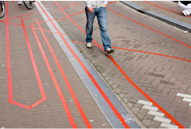
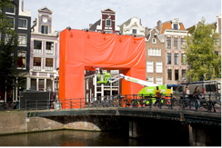
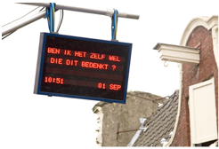
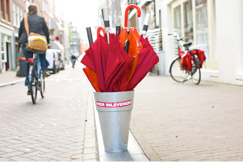
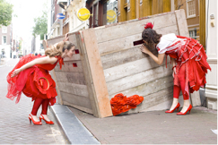
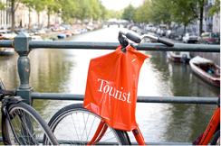

[{.left}](http://www.flickr.com/photos/13274211@N00/1816503628/)
Parmis les quartiers du centre-ville, il en est un qui, bien que peu connu est apprécié aussi bien par les touristes que par les locaux. C'est le quartier des **9 ruelles** ou ''Negen straatjes** situé à l'ouest de la ceinture de canaux du centre ville d'Amsterdam.

Les *[9 stratjes](http://www.de9straatjes.nl/)* est donc un quartier formé de 3 axes perpendiculaires aux tois principaux canaux d'Amsterdam : **Prinzengracht**, **Herengracht**, **Keizergracht** et le **Singel**. Les ruelles formant ces axes perpendiculaires changent de nom à chaque franchissement de canal ce qui donne bien 9 ruelles. Les maisons bordant les canaux ont été construites au 17ème siècle ce qui rend le **quartier typique d'Amsterdam**. 

Les rues ne sont pas piétonnes à proprement parler mais leur étroitesse et les multiples dos-d'âne font que les voitures évitent d'y passer. Les multiples boutiques qui bordent ces neuf ruelles attirent les piétons qui flannent bien souvent au milieu de la route. Non vraiment, ces ruelles ne sont pas pour les voitures. C'est sûrement ce qui les rend si agréables. Les boutiques implantés sur ces ruelles accrochent le piéton nonchalant. On y trouve des magasins de design, des antiquités et des librairies spécialisés ainsi que fromagers au vaste choix, des **restaurants** et des **marchands de fringues** de **créateurs** ou des **bijoutiers**, **antiquaires**. Bon, cette description donne l'esprit des ruelles, il vous est possible de trouver des mauvais snacks et des boutiques de chaine mais c'est plutôt rare et ces derniers se fondent bien dans l’esprit des neuf ruelles. C'est là que je vais souvent chercher mon sandouiche du midi chez [Hartenkaas](http://www.hartenkaas.nl/) qui est sans doute l'un des meilleurs sandouiche de la ville.

Pour ceux qui voudrait retrouver ces *negen straatjes* sur un plan voici la liste des rues dans l'ordre en partant du nord-ouest. Wikimapia vous aide à les [voir de haut](http://wikimapia.org/#lat=52.3706604&lon=4.8852468&z=17&l=0&m=a&v=2).

**| | Reestraat    | | Hartenstraat  | | Gasthuismolensteeg | |**  
**| | Berenstraat | | Wolvenstraat | | Oude Spiegelstraat | |**  
**| | Runstraat    | | Huidenstraat  | |  Wijde Heisteeg | |__

Les canaux allant d'une rue à l'autre sont considérés comme faisant partie du quartier, il y a peut être plus de voiture mais les trottoirs sont larges et se promener le long des canaux est aussi un must de balade à Amsterdam. Les bâtiment bordant les canaux sont plus prestigieux. On y trouve des hôtels, quelques bureaux et le musée de la Bible, le fameux *[Bijbels Museum](http://www.bijbelsmuseum.nl/default.aspx)* aux jolies façades de pierre[^1].

Une association des commerçants des *negen straatjes* existe, qui essaye de promouvoir le quartier. depuis 1999, elle organise *Het Negen Straatjes Festival*, le festival des neuf ruelles ou chaque boutique peut participer. Cette année, pour le neuvième festival des neuf ruelles, le quartier passe au rouge sans pour autant essayer de concurrencer un autre quartier d'Amsterdam...

Neuf artistes ont habillé de rouge, chacun à leur manière, chacune des neuf ruelles. C'est à voir du 1er au 10 septembre 2008, pendant neuf jour donc. pour ceux qui sont loin, en voici quelques vues, piquées sur le site du sponsor, Vodafone. Et oui, depuis que [Orange n'existe plus aux Pays-Bas](/orange-magenta), le rouge est le nouveau orange...

<!-- HTML -->
<table cellpadding="10" align="center"><tr><td>
<!-- / HTML -->

<!-- HTML -->
</td><td>
<!-- / HTML -->

<!-- HTML -->
</td></tr><tr><td>
<!-- / HTML -->

<!-- HTML -->
</td><td>
<!-- / HTML -->

<!-- HTML -->
</td></tr><tr><td>
<!-- / HTML -->

<!-- HTML -->
</td><td>
<!-- / HTML -->

<!-- HTML -->
</td></tr></table>
<!-- / HTML -->
---
[^1]: Les maisons de canaux en pierre sont rare à Amsterdam
<!-- post notes:
De namen van een aantal van deze straatjes herinneren aan de ambachten die hier vroeger werden uitgeoefend, zoals het bewerken van huiden van beren, herten (harten), ree, rund en wolven.
 * Les noms d'un nombre de ceux-ci rappellent straatjes aux métiers qui ont été pratiqués ici autrefois, comme travailler les peaux barrir, des cerfs (harten), du chevreuil, du rund et des loups. 
http://www.molblog.nl/Merken/7428/fromfeed
http://www.mijnnl.nl/amsterdam/agenda/de_negen_straatjes_rood/artikelen/10556
http://vetteshittv.wordpress.com/2008/09/03/9-straatjes-rood-ja-ja-ja/
http://www.blend.nl/weblog/archives/2008/06/de_9_straatjes.html
--->
