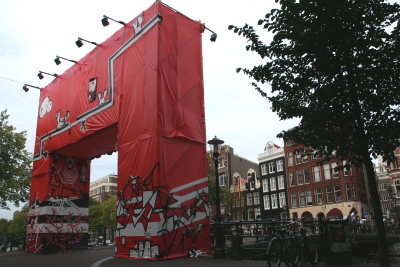
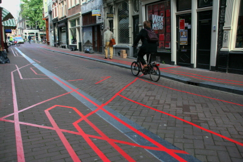

Puisque vous avez été sages, voici deux photos prises pendant cette semaine. J'ai un peu tardé à vous les montrer mais c'est parce que ça prend du temps de les développer.
  

La porte rouge à l'entée des 9 straatjes (devant <b>Wijde Heisteeg</b>), à proximité de Spui 
 

L'une des 9 straatjes (<b>Gasthuismolensteeg</b>) avec des lignes rouges sur le sol. Notez le magasin <b>Wax Reccords</b> à l'arrière plan qui a rempli sa vitrine de rouge.

