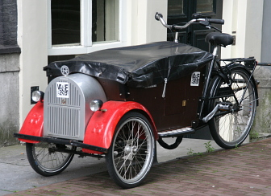

Ce dimanche c'est la journée sans voiture. Comme l'année dernière, il va y avoir des animations dans plusieurs quartiers mais surtout dans le mien (**le Pijp**), bien qu'en fait il y a plein de choses prévues dans la ville (voir plus bas). À ceux qui viennent en voiture pour visiter la ville ont peut déjà dire mauvaise idée...

Le site *[Autovrij Amsterdam](http://www.autovrijedag.amsterdam.nl/live/main.asp)* devrait vous aider à préparer votre voyage. Les [parkings P+R en périphérie de la ville](/pour-ceux-qui-viennent-nous-voir-en-voiture) et les transports en commun sont gratuits pour la journée, il y a donc une bonne raison de se priver de sa voiture.

Le [dépliant de la journée](http://www.autovrijedag.amsterdam.nl/live/bijlagen/autovrij_2008/documenten/programmaboekje_autovrijedag2008.pdf) (PDF), détaille les renseignements pratiques pour garer sa voiture et se déplacer en ville mais surtout liste les 101 activités proposées un peu partout. La première de la liste est la course pédestre *Dam tot Damloop* (la course d'un barrage à l'autre) reliant Zaan**dam** à Amster**dam**[^1]. Cette course est désormais une classique et elle emprunte un tunnel sous l'IJ, l'ancien bras de mer coupant Amsterdam d'est en ouest. Habituellement les tunnels sous l'IJ sont exclusivement réservés aux voitures, laissant les vélos et les piétons prendre le bac en surface. Mais en cette journée sans voiture les coureurs peuvent emprunter ce chemin inhabituel sous l'eau.

{.left}
Dans mon quartier du pijp aussi de nombreuses activités sont proposées. Sur la rue [Albert Cuyp](/albert-cuyp-le-marche), il y a quelque chose à faire tous les trois mêtres (C'est là que je me suis baladé [l'année dernière](/le-pijp-en-fete), entre différentes scènes musicales, salons de thé orientaux, ateliers peinture...). Cette année une affiche a attiré mon attention sur **une parade de vélo-bennes** (les fameux *bakfiets*[^2]). Cette *bakfietsparade* organisée par *GroenLinks* (les verts néerlandais), est en fait un défilé de vélos décorés exclusivement réservé aux bakfiets. Le plus bel équipage gagne une révision gratuite. C'est une bonne occasion de découvrir ces coûteux vélos dans un pays ou la petite reine est élevée au rang d'art de vivre.

Lire aussi :

<!-- HTML -->

<a href="/plein-de-velos-hollandais" title="tout savoir sur la bicyclette aux Pays-Bas">
<!-- / HTML -->
**Plein de vélos hollandais**  
{.center}  
1) Les avantages  
<!-- HTML -->
</a>

<!-- / HTML -->

<!-- HTML -->

<a href="/plein-de-velos" title="tout savoir sur la bicyclette aux Pays-Bas">
<!-- / HTML -->
**Plein de vélos hollandais**  
{.center}  
2) Les styles
<!-- HTML -->
</a>

<!-- / HTML -->

<!-- HTML -->

<a href="/plein-de-velos-hollandais-3" title="tout savoir sur la bicyclette aux Pays-Bas">
<!-- / HTML -->
**Plein de vélos hollandais**  
{.center}  
3) Les marques
<!-- HTML -->
</a>

<!-- / HTML -->

<!-- HTML -->

<a href="/plein-de-velos-pas-hollandais-4" title="tout savoir sur la bicyclette aux Pays-Bas">
<!-- / HTML -->
**Plein de vélos hollandais**  
{.center}  
4) Les marques étrangères
<!-- HTML -->
</a>

<!-- / HTML -->

<!-- HTML -->

<a href="/une-heure-sans-velo" title="tout savoir sur la bicyclette aux Pays-Bas">
<!-- / HTML -->
**Plein de vélos hollandais**  
{.center}  
5) Parking à vélos
<!-- HTML -->
</a>

<!-- / HTML -->

<!-- HTML -->

<a href="/les-velos-de-location" title="tout savoir sur la bicyclette aux Pays-Bas">
<!-- / HTML -->
**Plein de vélos hollandais**  
{.center}  
6) Vélos de location
<!-- HTML -->
</a>

<!-- / HTML -->

<!-- HTML -->

<!-- / HTML -->
---
[^1]: Je n'ai pas besoin de vous expliquer que Zaandam est une ville au nord d'Amsterdam, ni de vous expliquer que la première est situé près d'un barrage (*dam*) sur la rivière **Zaan** alors que la seconde est construite sur la rivière **Amstel**, elle aussi au niveau d'un barrage.
[^2]: Les *bakfietsen* ont été largement adoptés par les couples bobos pour emmener les enfants à l'école, ces bicyclettes de livraison sont devenu depuis quelques années des objets très *trendy* de la scène Amstelodamoise.