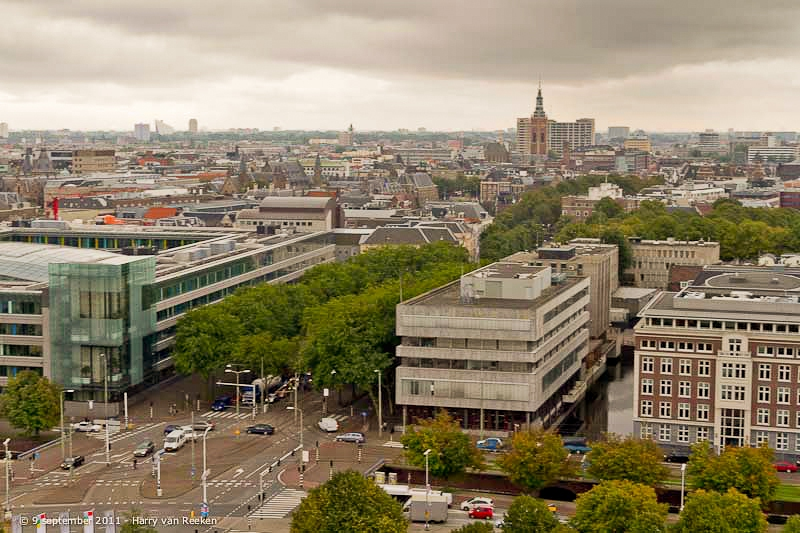

Avec la rentrée, beaucoup de changements. Les élèves de l'école française à Amsterdam vont découvrir leur nouveau directeur mais ce n'est pas le le seul poste français qui change au Pays-Bas, on dirait que toute l'administration française dans le pays se renouvelle, à commencer par notre ambassadeur.

Depuis hier, M. [Jean-François BLAREL](http://www.ambafrance-nl.org/spip.php?article224) est officiellement nouvel **Ambassadeur Plénipotentiaire de la République Française aux Pays-Bas**. Il remplace  M. Jean-Michel GAUSSOT que j'ai eu le plaisir de rencontrer [en 2007](/juillet-sans). Le nouvel ambassadeur a remis ses lettres de créances à la Reine Beatrix le 3 Septembre comme l'ont fait tous les ambassadeurs avec les monarques en poste depuis 1583. M. Jean-François BLAREL a sa biographie en ligne sur le site de l'Ambassade depuis quelques jours. Mais il n'est pas le seul a poser ses valises dans le building de smidsplein. Le premier conseiller de l'ambassade, numéro deux de la diplomatie française en pays batave est aussi une nouvelle tête.

*le building gris de l'Ambassade de France à la Haye*

<!-- source https://www.haagsefotos.nl/ngg_tag/korte-voorhout/nggallery/page/2 -->
<!-- Gone  -->

A Amsterdam aussi il y a du changement. L'**Institut Français**, plus connue sous le nom de **maison Descartes** va recevoir une nouvelle directrice, Madame Isabelle MALLEZ qui devrait prendre ses fonctions juste après la [journée portes ouvertes organisée le 6 septembre](http://www.maisondescartes.com/site/institut/open-dag-6-septembre-2008.html). Le consulat est situé la porte a coté de l'institut et là aussi il y a du changement. Le nouveau **Consul Général**, M. [Olivier Nicolas](http://www.consulfrance-moncton.org/article.php3?id_article=1) prendra ses fonctions le 15 septembre prochain en compagnie d'un Consul Général adjoint nouveau lui aussi.

Bref, les chaises tournent au ministère des affaires étrangères et si j'en crois le Figaro, il est demandé aux ambassadeurs de faire [un peu plus la promotion de l'économie française](http://www.lefigaro.fr/economie/2008/08/29/04001-20080829ARTFIG00019-bercy-veut-mobiliser-les-ambassadeurs-sur-l-economie-.php). Il semblerait que nos nouveau diplomates fassent partie des jeunes qui ont compris le message comme l'explique l'article.

Il n'y a pas que les diplomates qui changent en cette rentrée puisque les directeurs de l'**[Alliance Française](http://www.alliance-francaise.nl/index.php)** de [Rotterdam](http://www.alliance-francaise.nl/rotterdam/) et de [La Haye](http://www.aflahaye.nl/) viennent eux aussi de prendre leur poste.

Lire aussi:

* [La presse d'ici en français](/je-lis-deja-les-journaux)
* [La nouvelle ambassade de France](/Une-nouvelle-Ambassade-de-France)
* [Un ambassadeur qui tombe à pic](/Un-ambassadeur-qui-tombe-a-point-nomme)

<!-- post notes:
http://www.lemonde.fr/actualite-medias/article/2008/09/03/le-monde-et-le-ministere-des-affaires-etrangeres_1090925_3236.html 

http://www.novatv.nl/index.cfm?ln=nl&fuseaction=artikelen.details&achtergrond_id=8795
http://web.inter.nl.net/users/interniek/hagazine/archief/blumnanajaune.JPG 
http://www.expatries.diplomatie.gouv.fr/default.aspx?SID=12291&DYN_VIEW=DETAIL&PAYS=PAYS-BAS
--->
