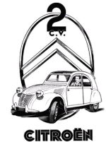

{.right}

Aujourd'hui, 7 Octobre 2008, c'est l'anniversaire de la **Citroën 2CV**. La voiture qui fut ma première voiture fête ses **60 ans** en ce moment. Ça a du être la fête sur le stand Citroën au mondial de l'automobile de Paris[^1]. Pour ma part, je voulais saluer l'anniversaire de la voiture crée par André Lefebvre à ma manière, avec deux promesses et une anecdote.

## L'anecdote

On va commencer par l'anecdote. Ma première voiture est **une deux chevaux**, vous le savez... Mais saviez-vous que c'était **une 2CV orange**. À l'époque j'ai plus choisi ce modèle pour le prix modique que sa couleur. Mais c'est rigolo de penser que dans les années 90, je promenais sur les routes la couleur nationale de mon pays d'accueil de quelques 15 ans plus tard... Si j'avais su, j'aurais peut-être évité cet accident qui a envoyé ma deuche à la casse... 

Aujourd'hui, je n'ai plus de deudeuche ni même de voiture orange[^2]. Il reste la couleur orange, je vous ai parlé de cette couleur nationale *oranje* à plusieurs reprises déjà, pour la [fête de la reine](/fete-de-la-reine), ses [préparaifs oranges](/preparatifs-oranges) et autres festivités [sportives](/les-drapeaux-oranges) comme [le foot](/les-bleus-et-les-oranges), [le vélo](/equipe-rabobank) et [le hockey](/oranje-wereldkampioen).

## Les deux promesses

Les deux promesses sont des promesses d'articles que je suis pas obligées de tenir parce que je n'ai pas que ça à faire. J'aimerais pourtant vous dire... Savez-vous que **Citroën est la marque automobile française la plus néerlandaise** ? et à plusieurs titres. Vous ne le savez pas ? et bien je vais tâcher de vous expliquer tout ça dans un prochain article. 

La seconde promesse ? c'est un autre article dont je préfère ne pas évoquer le sujet maintenant. Patience donc...

Voir aussi [Citroën : La marque française la plus néerlandaise](/Citroen-marque-francaise-neerlandaise), riche d'enseignements sur la marque aux chevrons et les bataves

---
[^1]: Avec [le grand retour de la charleston](http://www.caradisiac.com/Citroen-C3-Charleston-serie-speciale-en-habits-d-anniversaire-53556.htm).
[^2]: Je n'ai plus de voiture du tout à Amsterdam, comme ça c'est plus simple. Alors si je vous rappelle [la révision du B'twin](/revision-du-btwin), je suis pas hors sujet non ?