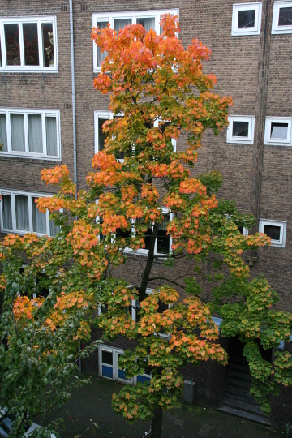

Il faisait froid ce matin en sortant de la maison, un petit froid annonciateur de l'hiver. En fait, en observant autour de moi, j'ai bien remarqué que c'était la fin de l'été. Il n'y a pas de colchiques à Amsterdam mais beaucoup d'autres signes.

## Déjà la nuit ?
Le signe le plus visible est la vitesse à laquelle les jours racourcissent. J'ai déjà parlé de la brièveté des jours d'hivers ou les plus photosensibles d'entre nous ont beaucoup moins la pêche. Le changement est d'autant plus notable que pendant l'été (surtout juin et juillet), les jours sont vraiment très long et c'est vraiment très agréable. Ce temps là est passé et c'est là qu'on comprend qu'on va devoir passer les huit prochains mois enfermés dans la chaleur des cafés bruns.

{.right}
## La feuille d'automne
Un des secrets d'Amsterdam, le mieux dissimulé des yeux des touristes est la verdures des jardins. Pour le constater il faut aller dans les maisons, chez les gens et contempler la verdure des jardins de derrière (*achtertuin*). En cette saison, c'est l'explosion de couleurs ; couleurs variées à l'image de la variété d'essences plantées par les propriétaires de ces jardins. Il faut en profiter car le vent qui souffle ici en rafales emporte très vite les feuilles d'automne. Les arbres de la rue sont aussi de la fête mais déjà les employés municipaux évacuent les feuilles mortes avec leurs grosses souffleries vacarmuantes. 

## Les lampes sur les vélos
Conséquence directe de la tombée rapide de la fin de nuit, les vélos se doivent d'avoir [une lumière](/lumieres-hiver) qui fonctionne à l'avant et à l'arrière. Les contrevenant s'exposent à une amande de 20 euros (bonne nouvelle, ça n'a pas augmenté depuis l'année dernière). Comme toujours, pendant quelques jours, les policiers laissent circuler les vélos sans lumière après 5 heures mais après un temps, temps où tout le monde a bien réalisé qu'il fallait s'équiper, crac# plein de contrôles inopinés à chaque coin de rue. Ce moment est arrivé, vous êtes prévenus. 20 euros...

## Les carillons sonnent
Les carillons d'Amsterdam sont connus dans le monde entier et apprécié des touristes quand ils sonnent l'heure ou la demie de haut de leurs tours. Les habitants sont peut être un peu plus blasés d'entendre tout le temps [les mêmes mélodies](http://www.centrum.amsterdam.nl/smartsite.dws?id=21596). C'est pourquoi ces dernières sont changées au printemps et à l'automne. Durant les quinze derniers jours, une entreprise spécialisé en automatisme et un joueur de carillon ont changé les réglages de chaque carillon pour que chacun d'entre eux sonne une nouvelle mélodie au quart, à la demie, à moins le quart et à l'heure pile. Un changement que j'ai remarqué cette année, moi qui travaille à deux pas de Westerkerk (la mélodie de Westertoren a été changée le 7 octobre dans l'après-midi, je m'en souviens)

## C'est la fin de l'heure d'été
N'oubliez pas, ce dimanche 26 octobre, à une heure, nous repassons à l'heure (normale) d'hiver. Aux Pays-Bas, comme on n'a pas envie de se compliquer la vie avec les voisins, on passe à l'heure d'hiver en même temps que la France et la Belgique. Ici on appelle ça *wintertijd* alors que les belges disent *winteruur*. La vraie raison pour laquelle tout le monde passe à l'heure d'hiver le dernier dimanche d'octobre est peut-être le respect de la [directive 2000/84/CE](http://eur-lex.europa.eu/LexUriServ/LexUriServ.do?uri=CELEX:32000L0084:FR:HTML) du Parlement et du Conseil Européens. Ce dimanche, vous êtes prévenus, changez l'heure de votre montre et n'oubliez pas la lumière de votre vélo.

## et aussi
[La bière d'automne](/la-herfst-bokbier-biere-d-automne)
---